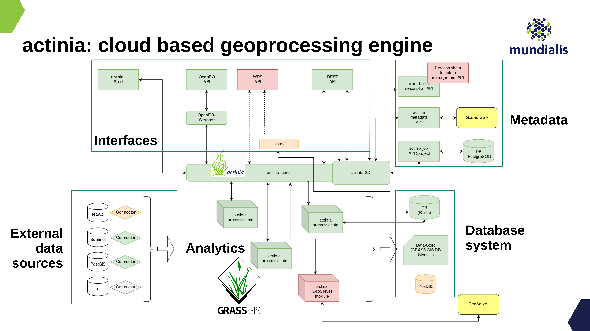

# Some Concepts

<!--
(duration: 10 min)
-->

For this tutorial we assume working knowledge concerning **geospatial analysis and Earth observation** (i.e., geodata such as raster, vector, time series, and image data including aerial, drone, and satellite data).
The tutorial includes, however, a brief introduction to **REST** (Representational State Transfer) API basics and cloud processing related hints.

## Why cloud computing?

With the tremendous increase of available geospatial and Earth observation lately driven by the European <a href="https://www.copernicus.eu">Copernicus programme</a> (esp. the Sentinel satellites) and the increasing availability of open data, the need for computational resources is growing in a non-linear way.

Cloud technology offers a series of **advantages**:

* scalable, distributed, and high performance processing
* large quantities of Earth Observation (EO) and geodata provided in dedicated cloud infrastructures
* addressing the paradigm of computing next to the data
* no need to bother yourself with the low-level management of tons of data.

(Ideally) enjoy the **five V’s of big data**: Volume, velocity, variety, veracity and value.

Still, some critical **issues** have to be addressed in the geospatial realm:

* lack of Analysis-Ready-data (ARD) available for consumption in the cloud
* lack of compatibility between different data systems
    * btw., we are on it: the [openEO H2020 project](https://openeo.org)
* lack of cloud abstraction, needed for easier move between vendors and providers.

## Overview actinia

Actinia ([https://actinia.mundialis.de/](https://actinia.mundialis.de/)) is an **open source REST API for scalable, distributed, high performance processing of geospatial and Earth observation data** that uses mainly GRASS GIS for computational tasks. Core functionality includes the processing of single scenes and time series of satellite images, of raster and vector data. With the existing (e.g. Landsat) and Copernicus Sentinel big geodata pools which are growing day by day, actinia is designed to follow the paradigm of bringing algorithms to the cloud stored geodata. Actinia is an OSGeo Community Project since 2019. The source code is available on GitHub at [https://github.com/actinia-org/actinia-core](https://github.com/actinia-org/actinia-core). It is written in Python and uses Flask, Redis, and other components.

### Components of actinia

Actinia is composed of several components.

Core system:

* [actinia-core](https://github.com/actinia-org/actinia-core/): an open source REST API for scalable, distributed and, high performance processing of geographical data that uses mainly GRASS GIS for computational tasks. It can be installed as is or enhanced with multiple plugins.

API:

* [actinia-api](https://github.com/actinia-org/actinia-api): API description for actinia_core and official plugins.

Plugins:

* [actinia-module-plugin](https://github.com/actinia-org/actinia-module-plugin): contains module self-description and process-chain-template management and processing
* [actinia-metadata-plugin](https://github.com/actinia-org/actinia-metadata-plugin): contains communication with a metadata catalog via OGC-CSW, in usage with GeoNetwork opensource
* [actinia-statistic-plugin](https://github.com/actinia-org/actinia-statistic-plugin): designed for computing raster map and raster-time-series statistics for categorical and continuous data
* [actinia-satellite-plugin](https://github.com/actinia-org/actinia-satellite-plugin): designed for efficient satellite data handling, especially Landsat and Sentinel-2 scenes
* [actinia-stac-plugin](https://github.com/actinia-org/actinia-stac-plugin): Plugin for actinia to read STAC catalogs and retrieve data for processing
* [actinia-tiling-plugin](https://github.com/actinia-org/actinia-tiling-plugin): Plugin for actinia to tile areas, e.g. to process them in parallel
* [actinia-parallel-plugin](https://github.com/actinia-org/actinia-parallel-plugin): Plugin for actinia to allow to specify parallel processes for faster processing (WIP)
* ([actinia-example-plugin](https://github.com/actinia-org/actinia-example-plugin): A small example plugin for actinia-core. This can be used as base for developing an own plugin)

Related:

* [openeo-grassgis-driver](https://github.com/Open-EO/openeo-grassgis-driver): OpenEO driver for GRASS GIS/actinia. Backend description at [https://openeo.mundialis.de/.well-known/openeo](https://openeo.mundialis.de/.well-known/openeo)

<center>
<a href="../img/actinia-plugins.png"></a><br>
Fig. 1: Components of actinia (core and plugins)
</center>

**Functionality beyond GRASS GIS**

Actinia is not only a REST interface to GRASS GIS, but it offers the possibility to extend its functionality with other software (ESA SNAP, GDAL, ...). To integrate other than GRASS GIS software, a wrapper script is to be written (style: as a GRASS GIS Addon Python script) which then includes the respective function calls of the software to be integrated. Calling shell commands in an actinia process chain is also possible but limited due to security risks.

**Persistent and ephemeral databases**

**Persistent storage** refers to a data store that retains data even in the event of a power-off, as well as retaining it without a scheduled deletion time. In the geo/EO context, persistent storage is used to provide, for example, base cartography, i.e. elevation models, road networks, building footprints, etc.

The **ephemeral storage** is used for on demand computed results including user generated data and temporary data as occurring in processing chains. In an ephemeral storage, data are only kept for a limited period of time (e.g., in actinia, for 24 hs by default).

In the cloud computing context these differences are relevant as cost incurs when storing data.

Accordingly, actinia offers two modes of operation: persistent and ephemeral processing. In particular, the **actinia server** is typically deployed on a server with access to a persistent GRASS GIS database (PDB) and optionally to one or more GRASS GIS user databases (UDB).

Actinia is deployed multiple times as so called **actinia nodes** (separate physically distinct machines) where the actual computations are performed. They can be deployed with the help of cloud technology like e.g. kubernetes, openshift and docker-swarm. This technology then acts as a **load balancer**, distributing jobs to actinia nodes. Results are either stored in GRASS UDBs in GRASS native format or directly exported to a different data format (see Fig. 2).

<center>
<a href="../img/actinia_PDB_UDB.png"></a><br>
Fig. 2: Persistent and ephemeral storage with actinia nodes (source: [mundialis FOSS4G talk 2019](https://mundialis.github.io/foss4g2019/grass-gis-in-the-cloud-actinia-geoprocessing/index.html))
</center>

**Architecture of actinia**

Several **components** play a role in a cloud deployment of actinia (for an example, see Fig. 3):

* analytics: here are the workers of GRASS GIS or wrapped other software (GDAL, ESA-SNAP, ...),
* external data sources: import providers for various external data sources,
* interface layer:
    * most importantly, the **REST API**,
    * [openEO GRASS GIS driver](https://github.com/Open-EO/openeo-grassgis-driver),
    * ace - [actinia command execution](https://github.com/actinia-org/ace) (to be run in a GRASS GIS session),
* metadata management: interface to Geonetwork Opensource via OGC-CSW, managed through [actinia-metadata-plugin](https://github.com/actinia-org/actinia-metadata-plugin),
* module self-description and process-chain-template management and processing, managed through [actinia-module-plugin](https://github.com/actinia-org/actinia-module-plugin),
* database system:
    * job management in a Redis database,
    * the GRASS GIS database (here are the geo/EO data stored!),
* connection to OGC Web services for output:
   * Geoserver integration.

<center>
<a href="../img/actinia_architecture_FTTH.png"></a><br>
Fig. 3: Example architecture of an actinia deployment (source: mundialis)
</center>

### Deployment

In short, deployment means starting software, usually in an automated way on one or more computer nodes. There are a number of technologies for this. In particular, virtualisation plays an important role here, which avoids a high dependency on hardware and software characteristics through abstraction.

An aim is to operate **Infrastructure as Code** ([IaC](https://en.wikipedia.org/wiki/Infrastructure_as_code)), i.e. to have a set of scripts which order the needed computational resources in the cloud, setup the network and storage topology, connect to the nodes, install them with the needed software (usually docker based, i.e. so-called containers are launched from prepared images) and processing chains. Basically, the entire software part of a cloud computing infrastructure is launched "simply" through scripts with the advantage of restarting it easily as needed, maintain it and migrate to other hardware.

**CI/CD** systems (continuous integration/continuous deployment) allow to define dependencies, prevent from launching broken software and allow the versioning of the entire software stack.

With respect to actinia, **various ways of [deployment](https://github.com/actinia-org/actinia-core/tree/master/docker)** are offered: local installation, docker, docker-compose, docker-swarm, Openshift, and kubernetes.

## REST API and geoprocessing basics

<!--
(duration: 20 min)
-->

### What is REST: intro

An **API** (Application Programming Interface) defines a way of communicating between different software applications. A **RESTful** API (Representational State Transfer - REST, for details see [https://en.wikipedia.org/wiki/Representational_state_transfer](https://en.wikipedia.org/wiki/Representational_state_transfer)) is a web API for communicating with web resources.

In detail, a REST API uses URL arguments to specify what information shall be returned through the API. This is not much different from requesting a Web page in a browser, but through the REST API we can **execute commands remotely and retrieve the results**.

Each URL is called a **request** while the data sent back to the user is called a **response**, after some **processing** was performed.

There are two types of request: **synchronous** and **asynchronous**. In the case of a synchronous request, the client sends it to the server and waits for a response. In geospatial computing, processing can take some time, which would block the client because it is only waiting. In default configurations the communication is canceled by the client after some minutes, called a "timeout". To avoid this, there is also the asynchronous request type. Here the client does not wait directly for a response, but checks from time to time whether the job has been completed (by "polling"), or by providing an API itself which will be informed when the job is finished ("webhook").

A **request** requires/consists of four parts (see also [1]):

* the endpoint
* the header
* the data (or body)
* the methods

### Endpoint

In general, an endpoint is an entry point to a service, a process, or a queue or topic destination in service-oriented architectures. In the case of actinia, it may be a data query function, the computation of a vegetation index, the deletion of a dataset, and more.
Effectively, an endpoint is the URL you request for. It follows this structure: https://api.some.server/endpoint.
The final part of an endpoint are the query parameters. Using query parameters you can modify your request with key-value pairs, beginning with a question mark (`?`). With an ampersand (`&`) each parameter pair is separated, e.g.:

`?query1=value1&query2=value2`

As an example, we check the repositories of a GitHub user, in sorted form, using the `repos` endpoint + query:

[https://api.github.com/users/mmacata/repos?sort=pushed](https://api.github.com/users/mmacata/repos?sort=pushed)

### Header & Body

* Both requests and responses have two parts: a header, and optionally a body
* Header information contain e.g. authentication
* In both requests and responses, the body contains the actual data being transmitted
* The request body is only necessary for certain HTTP methods (e.g. HTTP POST) and can contain any form of data, e.g. an actinia process chain
* The response body returns information or results. Examples in actinia are json data or GeoTIFF results

### Methods

Request **methods** (source: [2]):

* In REST APIs, every request has an HTTP method type associated with it.
* The most common HTTP methods (or verbs) include:
    * `GET` - a GET request asks to receive a copy of a resource
    * `POST` - a POST request sends data to a server in order to replace existing or create new resources
    * `PUT` - a PUT request sends data to a server in order to change or update resources
    * `DELETE` - a DELETE request is sent to remove or destroy a resource

### Response codes

* HTTP responses don't have methods, but they do have status codes: HTTP status codes are included in the header of every response in a REST API. Status codes include information about the result of the original request.
* Selected status codes (see also [https://httpstatuses.com](https://httpstatuses.com)):
    * `200` - OK | All fine
    * `404` - Not Found | The requested resource was not found
    * `401` - Unauthorized | The request was rejected, as the sender is not (or wrongly) authorized
    * `500` - Internal Server Error | Ouch, something went wrong while the server was processing your request

### Related data format: JSON

JSON is a structured, machine readable format (while also human readable; in contrast to XML, at least for many people). [JSON](https://json.org/) is short for JavaScript Object Notation. For example, this command line call...

```bash
GRASS (nc_spm_08):~ > v.buffer input=roadlines output=roadbuf10 distance=10 --json
```

... looks like the following in JSON:

```json
{
  "module": "v.buffer",
  "id": "v.buffer_1804289383",
  "inputs":[
     {"param": "input", "value": "roadlines"},
     {"param": "layer", "value": "-1"},
     {"param": "type", "value": "point,line,area"},
     {"param": "distance", "value": "10"},
     {"param": "angle", "value": "0"},
     {"param": "scale", "value": "1.0"}
   ],
  "outputs":[
     {"param": "output", "value": "roadbuf10"}
   ]
}
```

Hint: When writing JSON files, some linting (process of checking the source code for programmatic as well as stylistic errors) might come handy, e.g. by using [https://jsonlint.com/](https://jsonlint.com/).
