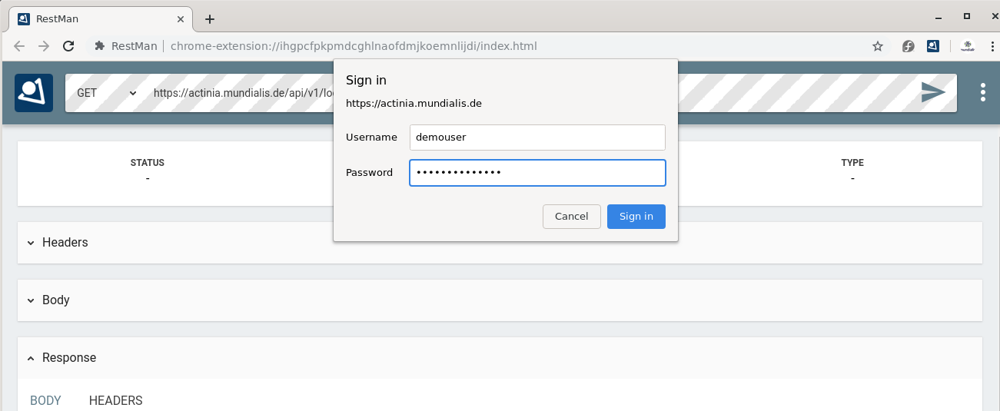
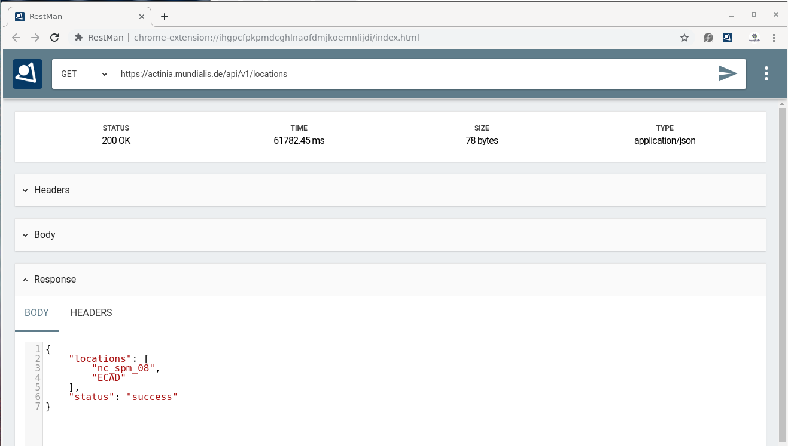
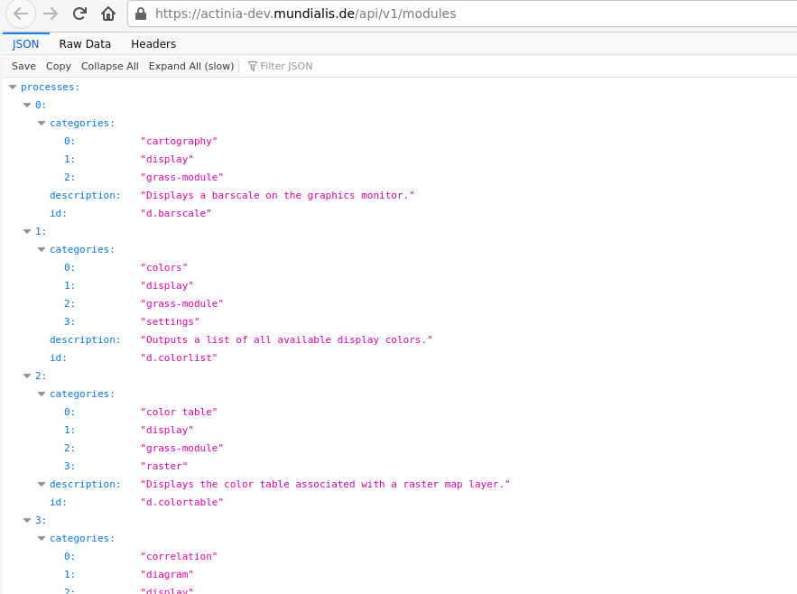
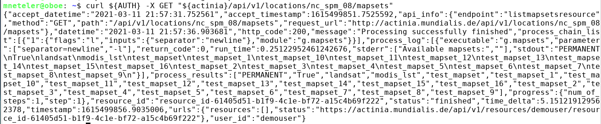
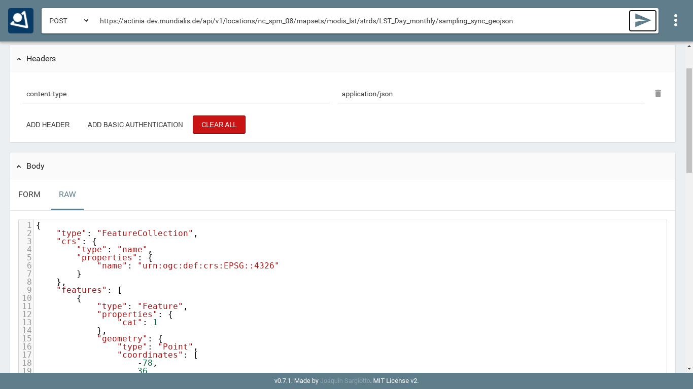
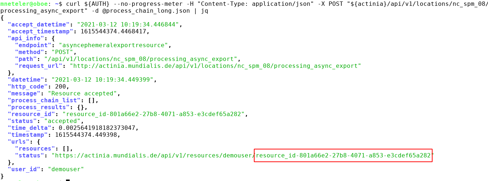
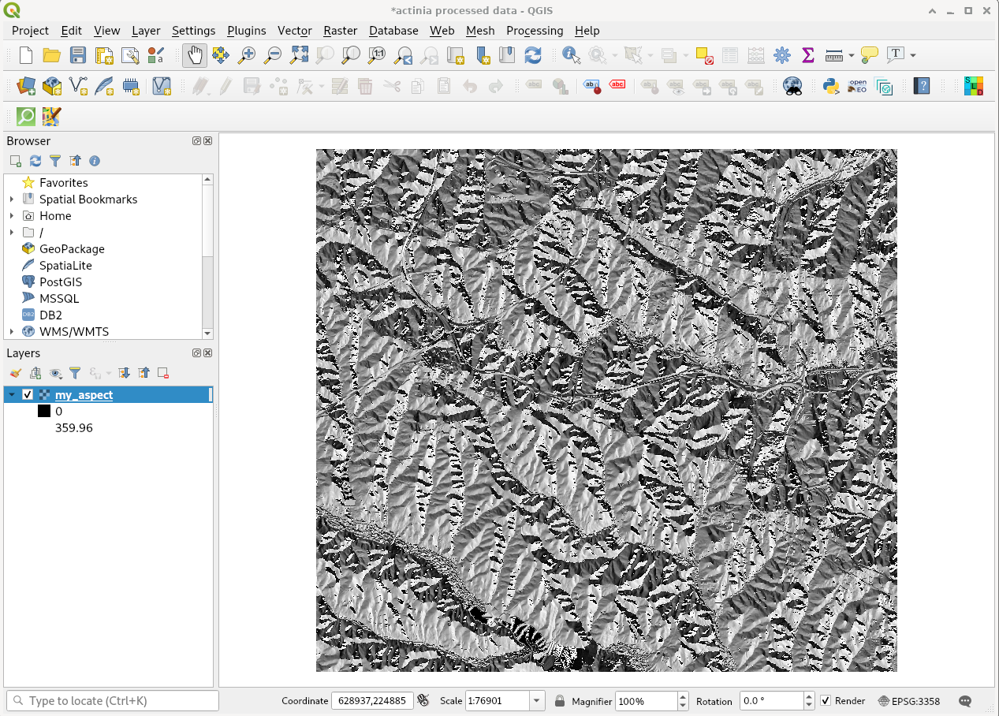

# Explore

## First Hand-on: working with REST API requests

<!--
(duration: 50 min)
-->

### Step by step...

Step 1:

* Get your credentials (for authentication) from the trainer or use the `demouser` with `gu3st!pa55w0rd`

Step 2:

* Try this call, simply in a browser: [https://actinia.mundialis.de/api/v1/locations](https://actinia.mundialis.de/api/v1/locations)
* What does it show?

Step 3:

* Choose and launch your REST client: cURL or RESTman or ...
    * a) [cURL](https://curl.haxx.se/docs/manpage.html), on command line
    * b) [Thunderclient plugin](https://www.thunderclient.io/), for VS Code editor or find a plugin for your favorite editor
    * c) [RESTman](https://chrome.google.com/webstore/detail/restman/ihgpcfpkpmdcghlnaofdmjkoemnlijdi) ([manual](https://github.com/jsargiot/restman)), in Browser
* Try the same request again:

<center>
<a href="../img/actinia_restman01.png"></a><br>
<a href="../img/actinia_restman02.png"></a><br>
Fig. 4: Using RESTman
</center>

For a `curl` example, see below ("[REST actinia examples with curl](index.html#rest-actinia-examples-with-curl)").

Step 4:

* Explore the existing data on the actinia server:
    * i.e., available GRASS locations, mapsets, raster, vector, and space-time datasets
    * Check the [list of data](https://github.com/mundialis/actinia_core/blob/master/scripts/README.md#available-data) currently available on the actinia server
    * e.g.
        * [https://actinia.mundialis.de/api/v1/locations](https://actinia.mundialis.de/api/v1/locations)
        * [https://actinia.mundialis.de/api/v1/locations/nc_spm_08/mapsets](https://actinia.mundialis.de/api/v1/locations/nc_spm_08/mapsets)
        * [https://actinia.mundialis.de/api/v1/locations/nc_spm_08/mapsets/landsat/raster_layers](https://actinia.mundialis.de/api/v1/locations/nc_spm_08/mapsets/landsat/raster_layers)
        * [https://actinia.mundialis.de/api/v1/locations/nc_spm_08/mapsets/landsat/raster_layers/lsat5_1987_10](https://actinia.mundialis.de/api/v1/locations/nc_spm_08/mapsets/landsat/raster_layers/lsat5_1987_10)
    * Note: `process_results` are ordered alphabetically, not thematically
    * Bonus: use the render endpoint. Here, no JSON but an image is returned: [https://actinia.mundialis.de/api/v1/locations/nc_spm_08/mapsets/landsat/raster_layers/lsat5_1987_10/render](https://actinia.mundialis.de/api/v1/locations/nc_spm_08/mapsets/landsat/raster_layers/lsat5_1987_10/render)

### Summary

So far we have seen some REST basics and explored a few endpoints provided by actinia.
Indeed the structure of the endpoints follow some GRASS GIS concepts (compare the graphical introduction above), but this does not limit us much from processing "any" geospatial data.


## Exploring the API: finding available actinia endpoints

<!--
(duration: 40 min)
-->

The actinia REST API documentation is available online (directly generated from the source code of actinia).
Check out some of the various sections in the [actinia API docs](https://redocly.github.io/redoc/?url=https://actinia.mundialis.de/api/v1/swagger.json):

* Module Viewer
* Process Chain Template Management
* Authentication Management
* API Log
* Cache Management
* File Management
* Satellite Image Algorithms
* Location Management
* Mapset Management
* Processing
* Raster Management
* Raster Statistics
* STRDS Management (STRDS = space-time raster data set)
* STRDS Sampling
* STRDS Statistics
* Vector Management
* Mapsets
* GeoNetwork
* Resource Management
* Process Chain Monitoring
* Resource Iteration Management
* User Management

List of endpoints, shown in the web browser:

* To see a simple **list of endpoints** (and more), have a look at the "paths" section in the [API JSON](https://actinia.mundialis.de/api/v1/swagger.json). If the formatting looks "ugly", get the [JSON Formatter](https://chrome.google.com/webstore/detail/json-formatter/bcjindcccaagfpapjjmafapmmgkkhgoa) extension.

<center>
<a href="../img/actinia_swagger_paths.png"></a><br>
Fig. 5: actinia list of endpoints (in the "paths" section)
</center>

* **List of supported processes** (> 500): see [API modules](https://actinia.mundialis.de/api/v1/modules) (note: the process chain templates are at bottom, category "actinia-module")

<center>
<a href="../img/actinia_modules.png"></a><br>
Fig. 6: actinia list of GRASS GIS processes (> 500)
</center>

List of endpoints shown on command line:

* To get the available endpoints on command line, run

```bash
## we filter the paths on the fly with `jq`
# note: no AUTH needed
curl --no-progress-meter -X GET https://actinia.mundialis.de/api/v1/swagger.json | jq "."paths | jq 'keys'
[
  "/actinia_modules",
  "/actinia_modules/{actiniamodule}",
  "/actinia_templates",
  "/actinia_templates/{template_id}",
  "/api_key",
  "/api_log/{user_id}",
  "/download_cache",
  "/files",
  "/grass_modules",
  "/grass_modules/{grassmodule}",
  "/landsat_process/{landsat_id}/{atcor_method}/{processing_method}",
  "/landsat_query",
  "/locations",
  "/locations/{location_name}",
  "/locations/{location_name}/info",
  "/locations/{location_name}/mapsets",
  "/locations/{location_name}/mapsets/{mapset_name}",
  "/locations/{location_name}/mapsets/{mapset_name}/info",
...
  "/sentinel2_query",
  "/sentinel2a_aws_query",
  "/token",
  "/users",
  "/users/{user_id}"
]
```


<!--
```
## alternative: we filter the paths on the fly with `json`
# installation: sudo npm install -g json

curl -X GET https://actinia.mundialis.de/api/v1/swagger.json | json paths | json -ka
 ... see above
```
-->

### REST actinia examples with curl

Here we use the command line and the `curl` software to communicate with the actinia server.
Optionally, to beautify the output, we use the `jq` command-line JSON processor which helps to turn the output into something human readable ([download jq](https://stedolan.github.io/jq/download/)).

Hint: If you have troubles to use `jq` on command line, you can also use it in a browser at [https://jqplay.org/](https://jqplay.org/): copy the JSON code into the "JSON" field, then a `.` into the "Filter" field and it will show the result.

#### Preparation

To simplify our life in terms of server communication we store the credentials and REST server URL in environmental variables (this is only relevant for command line usage; in RESTman the browser will request the credentials):

```bash
# set credentials and REST server URL
export actinia="https://actinia.mundialis.de"
export AUTH='-u demouser:gu3st!pa55w0rd'
```

#### List available locations

First, we want to see the list of available "locations". A location in GRASS-speak is simply a project folder which contains geospatial data:

```bash
# show available locations (locations are like projects)
curl ${AUTH} -X GET ${actinia}/api/v1/locations
```

<!--
#### Show capabilities of user

```bash
# NOTE: endpoint not available to the demouser but only to the admin user
# show accessible_datasets, accessible_modules, raster cell_limit, process_num_limit, process_time_limit
curl ${AUTH} -X GET "${actinia}/api/v1/users/demouser"
```
-->

#### List mapsets in locations

Next, we look at so-called "mapsets" which are subfolders in a location (just to better organise the geospatial data):

```bash
# show available mapsets of a specific location
curl ${AUTH} -X GET "${actinia}/api/v1/locations/nc_spm_08/mapsets"
```

<center>
<a href="../img/curl_output_std.png"></a><br>
</center>

Note the style difference of output:

```bash
# show available mapsets of a specific location
curl ${AUTH} -X GET "${actinia}/api/v1/locations/nc_spm_08/mapsets" | jqs
```

<center>
<a href="../img/curl_output_jq.png"></a><br>
</center>

#### List map layers and their metadata

Eventually, digging more for content in "location" and "mapsets", we can look at the datasets stored therein:

Vector data:

```bash
# show available vector maps in a specific location/mapset
curl ${AUTH} -X GET "${actinia}/api/v1/locations/nc_spm_08/mapsets/PERMANENT/vector_layers"
curl ${AUTH} -X GET "${actinia}/api/v1/locations/nc_spm_08/mapsets/PERMANENT/vector_layers" | jq

# note: you can always add `| jq`

# show metadata of a specific vector map
curl ${AUTH} -X GET "${actinia}/api/v1/locations/nc_spm_08/mapsets/PERMANENT/vector_layers/geology"
```

Raster data:

```bash
# show available raster maps in a specific location/mapset
curl ${AUTH} -X GET "${actinia}/api/v1/locations/nc_spm_08/mapsets/PERMANENT/raster_layers"
curl ${AUTH} -X GET "${actinia}/api/v1/locations/nc_spm_08/mapsets/landsat/raster_layers"
curl ${AUTH} -X GET "${actinia}/api/v1/locations/nc_spm_08/mapsets/modis_lst/raster_layers"

# show metadata of a specific raster map
curl ${AUTH} -X GET "${actinia}/api/v1/locations/nc_spm_08/mapsets/landsat/raster_layers/lsat7_2000_40"
```

Space-time raster datasets (STRDS):

```bash
# show available STRDS in a specific location/mapset
# MODIS Land Surface Temperature data
curl ${AUTH} -X GET "${actinia}/api/v1/locations/nc_spm_08/mapsets/modis_lst/strds"

# show specific STRDS in a specific location/mapset
# MODIS Normalized Difference Vegetation Index
curl ${AUTH} -X GET "${actinia}/api/v1/locations/latlong_wgs84/mapsets/modis_ndvi_global/strds/ndvi_16_5600m"

# Get a list or raster layers from a STRDS
# ECAD: Yearly precipitation
curl ${AUTH} -X GET "${actinia}/api/v1/locations/ECAD/mapsets/PERMANENT/strds/precipitation_1950_2013_yearly_mm/raster_layers"

# Get a list or raster layers from a STRDS, with date filter
# ECAD: Yearly precipitation
curl ${AUTH} -X GET "${actinia}/api/v1/locations/ECAD/mapsets/PERMANENT/strds/precipitation_1950_2013_yearly_mm/raster_layers?where=start_time>2012-01-01"
```

#### Render maps

This can be achieved by simply adding `/render` at the end of a layer resource:

```bash
curl ${AUTH} -X GET "${actinia}/api/v1/locations/nc_spm_08/mapsets/PERMANENT/raster_layers/geology_30m/render > geology_30m.png
curl ${AUTH} -X GET "${actinia}/api/v1/locations/nc_spm_08/mapsets/landsat/raster_layers/lsat7_2000_40/render" > lsat7_2000_40.png

```

#### Map layer and space-time cube queries

It's time to retrieve something from the server. We want to query the stack of multitemporal datasets available and more specifically, retrieve MODIS Land Surface Temperature (LST) values from the space-time cube at a specific position (North Carolina data set; at [78W, 36N](https://www.openstreetmap.org/?mlat=36.00&mlon=-78.00#map=10/36.00/-78.00)). For this, we use the endpoint [sampling_sync_geojson](https://actinia.mundialis.de/api/v1/locations/nc_spm_08/mapsets/modis_lst/strds/LST_Day_monthly/sampling_sync_geojson):

```bash
# query point value in a STRDS, sending a GeoJSON file of the point position along with the request
# (North Carolina LST time series)
curl ${AUTH} -X POST -H "content-type: application/json" "${actinia}/api/v1/locations/nc_spm_08/mapsets/modis_lst/strds/LST_Day_monthly/sampling_sync_geojson" -d '{"type":"FeatureCollection","crs":{"type":"name","properties":{"name":"urn:ogc:def:crs:EPSG::4326"}},"features":[{"type":"Feature","properties":{"cat":1},"geometry":{"type":"Point","coordinates":[-78,36]}}]}'
```

Using RESTman you need to pay attention to these changes:

* change type of request from GET to POST, in the top of the page lefthand of the URL
* set the right header `content-type` and `application/json` as value
* add the JSON in the body section in RAW format

<center>
<a href="../img/actinia_restman_post.png"></a><br>
Fig. 7 RESTman POST request example (source: Luca Delucchi)
</center>

#### Sending JSON payload as a file

In the example above we have sent JSON code to the server directly in the request. However, with longer process chains this is hard to manage. It is often much more convenient to store the JSON code as "payload" in a file and send it to the server:

```bash
# note: you can easily generate such a GeoJSON file with ogr2ogr or v.out.ogr
#
# store the query in a JSON file "pc_query_point_.json" (or use a text editor for this)
echo '{"type":"FeatureCollection","crs":{"type":"name","properties":{"name":"urn:ogc:def:crs:EPSG::4326"}},"features":[{"type":"Feature","properties":{"cat":1},"geometry":{"type":"Point","coordinates":[-78,36]}}]}' > pc_query_point_.json

# send JSON file as payload to query the STRDS
curl ${AUTH} -X POST -H "content-type: application/json" "${actinia}/api/v1/locations/nc_spm_08/mapsets/modis_lst/strds/LST_Day_monthly/sampling_sync_geojson" -d @pc_query_point_.json  | jq
```

#### Validation of a process chain

Why validation? It may happen that your JSON file to be sent to the endpoint contains a typo or other invalid content. For the identification of problems prior to executing the commands contained in the JSON file (which may last for hours), it is recommended to validate this file.
For this, actinia can be used as it provides a validation endpoint.

Example: Download the process chain [process_chain_long.json](https://github.com/mmacata/actinia-introduction/raw/main/docs/process_chain_long.json) and validate it:

```bash
# validation of a process chain (using sync call)
curl ${AUTH} -H "Content-Type: application/json" -X POST "${actinia}/api/v1/locations/nc_spm_08/process_chain_validation_sync" -d @process_chain_long.json
```

#### Converting a process chain back into commands

To turn a process chain back into command style notation, the validator can be used and the relevant code extracted from the resulting JSON response.
Download the process chain [process_chain_long.json](https://gitlab.com/neteler/actinia-introduction/raw/master/docs/process_chain_long.json) and extract the section containing the underlying commands by parsing the actinia server response with `jq`:

```bash
# command extraction from a process chain (using sync call) by parsing the 'process_results' response (here we use the `jq` tool:)
curl ${AUTH} --no-progress-meter -H "Content-Type: application/json" -X POST "${actinia}/api/v1/locations/nc_spm_08/process_chain_validation_sync" -d @process_chain_long.json | jq "."process_results
[
  "grass g.region ['raster=elevation@PERMANENT', 'res=10', '-p']",
  "grass r.slope.aspect ['elevation=elevation@PERMANENT', 'format=degrees', 'precision=FCELL', 'zscale=1.0', 'min_slope=0.0', 'slope=my_slope', 'aspect=my_aspect', '-a']",
  "grass r.watershed ['elevation=elevation@PERMANENT', 'convergence=5', 'memory=500', 'accumulation=my_accumulation']",
  "grass r.info ['map=my_aspect', '-gr']"
]
```

### Data exchange: import and export

Actinia can import from external Web resources, use data in the actinia server (persistent and ephemeral storage) and make results available for download as Web resources. These latter can then be downloaded, opened by QGIS, imported into GRASS GIS or other software.
Note that the download of Web resources provided by actinia requires authentication, e.g. the `demouser`.

**Available export formats**

At time (more to come) the following export formats are supported:

* raster: `COG`, `GTiff`
* strds: `GTiff` (multiple files packed in an tar.gz archive)
* vector: `PostgreSQL`, `GPKG`, `GML`, `GeoJSON`, `ESRI_Shapefile`, `SQLite`, `CSV`
* file: `CSV`, `TXT`


### Dealing with workflows (processing chains)

The overall goal is to "get stuff done". In this case it means that we can concatenate (chain) a series of commands where the output of one step may be used as the input of the following step.

The general procedure comprises:

* prepare a processing chain
* compare async(cronous) versus sync(cronous) REST API calls, decide which endpoint to use
* submit the processing chain to an actinia endpoint
* retrieve the result(s).

<!--
(see also: [https://github.com/mundialis/actinia_core/blob/master/scripts/curl_commands.sh#L77](https://github.com/mundialis/actinia_core/blob/master/scripts/curl_commands.sh#L77)
-->

To turn this concept into an example, we use again the process chain [process_chain_long.json](https://gitlab.com/neteler/actinia-introduction/raw/master/docs/process_chain_long.json) from above and execute it, here using the asynchonous `processing_async_export` endpoint. By this, the `exporter` in the process chain will be activated and deliver the computed maps as Web resources for subsequent download:

```bash
curl ${AUTH} --no-progress-meter -H "Content-Type: application/json" -X POST "${actinia}/api/v1/locations/nc_spm_08/processing_async_export" -d @process_chain_long.json | jq
```

Being an asynchronous process, the result is not offered directly but at the bottom of the JSON output (in the terminal) a resource ID (red box) and a resource URI is shown:

<center>
<a href="../img/curl_resource_id.png"></a><br>
</center>

Use this URI for retrieving the process status, e.g. using your browser (`F5` to reload page until job is ready).
Once the job has been completed ("Processing successfully finished"), three Web resources (here: COG - Cloud Optimized GeoTIFF) are shown at the bottom of the JSON output:

```bash
# update the URI to that of your job, and be sure to use https:
curl ${AUTH} -X GET "https://actinia.mundialis.de/api/v1/resources/demouser/resource_id-284d42c7-9ba7-415d-b675-cf1a534f4af0" | jq

...
  "status": "finished",
  "time_delta": 3.7403182983398438,
  "timestamp": 1580767679.525925,
  "urls": {
    "resources": [
      "http://actinia.mundialis.de/api/v1/resources/demouser/resource_id-284d42c7-9ba7-415d-b675-cf1a534f4af0/my_slope.tiff",
      "http://actinia.mundialis.de/api/v1/resources/demouser/resource_id-284d42c7-9ba7-415d-b675-cf1a534f4af0/my_aspect.tiff",
      "http://actinia.mundialis.de/api/v1/resources/demouser/resource_id-284d42c7-9ba7-415d-b675-cf1a534f4af0/my_accumulation.tiff"
    ],
    "status": "http://actinia.mundialis.de/api/v1/resources/demouser/resource_id-284d42c7-9ba7-415d-b675-cf1a534f4af0"
  },
  "user_id": "demouser"
}
```

The resulting files can now be downloaded (they'll remain for 24 hs on the server).

<center>
<a href="../img/qgis_actinia_data_viz.png"></a><br>
Fig. 8: actinia output shown in QGIS (aspect map)
</center>
