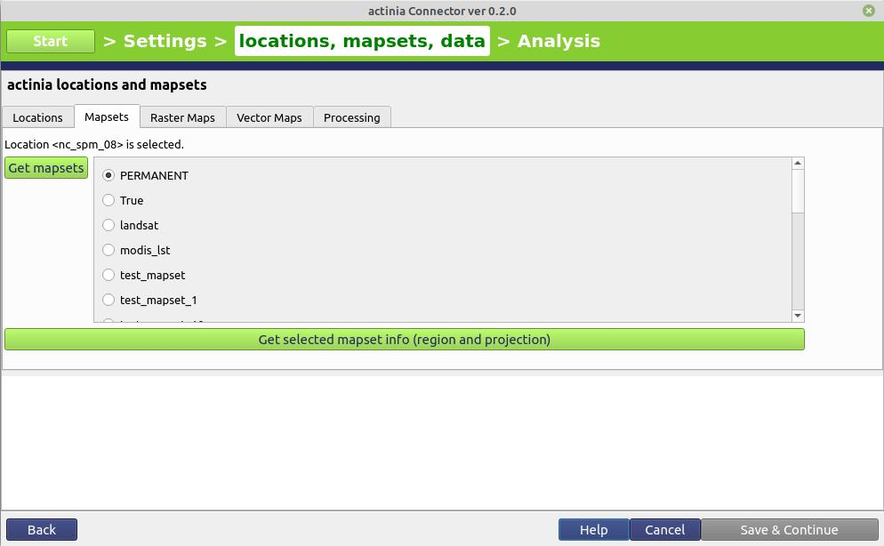

# Client implementations

<!--
(duration: 20 min)
-->

## actinia-python-client
Python library to access an actinia server easily via python.
See also [source code](https://github.com/mundialis/actinia-python-client) and [full documentation](https://mundialis.github.io/actinia-python-client/)

### Installation
```
VERSION="0.1.2"

pip3 install "actinia-python-client @ https://github.com/mundialis/actinia-python-client/releases/download/${VERSION}/actinia_python_client-${VERSION}-py3-none-any.whl"
```
### Quickstart
{{ external_markdown('https://raw.githubusercontent.com/mundialis/actinia-python-client/main/docs/docs/03_quickstart.md', '') }}

### Location Management
With the location management the locations can be requested as well as
information of each location. Also a location can be created and deleted if the user is permitted.
#### Get locations and locaton information of a special location:
{{ external_markdown('https://raw.githubusercontent.com/mundialis/actinia-python-client/main/docs/docs/04_location_management.md', '## Get locations and locaton information of a special location:') }}
#### Create a new location
(Attention: The demouser is not permitted to create or delete a location!)
{{ external_markdown('https://raw.githubusercontent.com/mundialis/actinia-python-client/main/docs/docs/04_location_management.md', '## Create a new location') }}
#### Delete a location
(Attention: The demouser is not permitted to create or delete a location!)
{{ external_markdown('https://raw.githubusercontent.com/mundialis/actinia-python-client/main/docs/docs/04_location_management.md', '## Delete a location') }}

### Mapset Management
With the mapset management the mapsets of a specified location can be
requested as well as information of each mapset.

Upcoming: Create and delete mapsets if the user is permitted.

#### Get Mapsets of Specified Location
{{ external_markdown('https://raw.githubusercontent.com/mundialis/actinia-python-client/main/docs/docs/05_mapset_managment.md', '## Get Mapsets of Specified Location') }}

### Raster, Vector and STRDS Management
#### Raster manangement
{{ external_markdown('https://raw.githubusercontent.com/mundialis/actinia-python-client/main/docs/docs/06_raster_vector_strds_managment.md', '## Raster manangement') }}
#### Vector manangement
{{ external_markdown('https://raw.githubusercontent.com/mundialis/actinia-python-client/main/docs/docs/06_raster_vector_strds_managment.md', '## Vector management') }}


### Process Chain Validation
A process chain can be validated before a job is started.

First connecting actinia Python library with [actinia](https://actinia.mundialis.de/) and set authentication:
```
from actinia import Actinia

actinia_mundialis = Actinia()
actinia_mundialis.get_version()
actinia_mundialis.set_authentication("demouser", "gu3st!pa55w0rd")

# request all locations
locations = actinia_mundialis.get_locations()
```
#### Synchronous process chain validation
{{ external_markdown('https://raw.githubusercontent.com/mundialis/actinia-python-client/main/docs/docs/07_process_chain_validation.md', '## Synchronous process chain validation') }}
#### Asynchronous process chain validation:
{{ external_markdown('https://raw.githubusercontent.com/mundialis/actinia-python-client/main/docs/docs/07_process_chain_validation.md', '## Asynchronous process chain validation:') }}


### Processing
Start a processing job with a valid process chain.

First connect actinia Python library with [actinia](https://actinia.mundialis.de/) and set authentication:
```
from actinia import Actinia

actinia_mundialis = Actinia()
actinia_mundialis.get_version()
actinia_mundialis.set_authentication("demouser", "gu3st!pa55w0rd")

# request all locations
locations = actinia_mundialis.get_locations()
```
#### Ephemeral Processing
{{ external_markdown('https://raw.githubusercontent.com/mundialis/actinia-python-client/main/docs/docs/08_processing.md', '## Ephemeral Processing') }}


## ACE - Controlling actinia from a running GRASS GIS session

Python library to access an actinia server easily via python.


### Introduction to ace - actinia command execution

Controlling actinia from a running GRASS GIS session is a convenient way of writing process chains. It requires some basic GRASS GIS knowledge (for an intro course, e.g. see [here](https://neteler.gitlab.io/grass-gis-analysis/)).

The `ace` (actinia command execution) tool allows the execution of a single GRASS GIS command or a list of GRASS GIS commands on an actinia REST service (e.g., https://actinia.mundialis.de/). In addition it provides job management, the ability to list locations, mapsets and map layer the user has access to as well as the creation and deletion of mapsets. The `ace` tool is a GRASS GIS addon and must be executed in an active GRASS GIS session.

All commands will be executed per default in an **ephemeral** database on the actinia server. Hence, generated output must be exported using augmented GRASS commands to be able to further use it.

Note: The option `mapset=MAPSET_NAME` allows the execution of commands in the **persistent** user database. It can be used with `location=LOCATION_NAME`option.

### Preparation

To use ace, some things are required:

* GRASS GIS ([download](https://grass.osgeo.org/download/))
* three additional Python packages: `click` `requests` `simplejson`
```
pip3 install click requests simplejson
```
* `nc_spm_08` North Carolina sample location
* An empty test mapset `ace` (only for demo)
```
grass -c nc_spm_08/ace
```
* `ace` itself, `importer` and `exporter`  tools as GRASS GIS extensions
```
g.extension extension=importer url=https://github.com/mundialis/importer
g.extension extension=exporter url=https://github.com/mundialis/exporter
g.extension extension=ace url=https://github.com/mundialis/ace
```

For more detailed information on how to set this up yourself, see [different actinia workshop](https://neteler.gitlab.io/actinia-introduction/#preparation_1).

### Authentication settings

The user must setup the following environmental variables to specify the actinia server and credentials:

```bash
# set credentials and REST server URL
export ACTINIA_USER='demouser'
export ACTINIA_PASSWORD='gu3st!pa55w0rd'
export ACTINIA_URL='https://actinia.mundialis.de/'
```

### List locations, mapsets and maps

In order to list the locations the user has access to, run

```bash
ace -l
['latlong_wgs84', 'nc_spm_08', 'ECAD']
```

The following command lists mapsets of current location in the active GRASS GIS session ("nc_spm_08"):

```bash
# running ace in the "nc_spm_08" location on server:
ace location="nc_spm_08" -m
['PERMANENT', 'landsat', 'modis_lst']
```

All following commands can be executed in any active GRASS GIS location, since the location name at the actinia server is explicitly provided. In case the location option is not provided, the active location will be used. The following command lists mapsets of the provided location **latlong_wgs84**:

```bash
ace location="latlong_wgs84" -m
['PERMANENT', 'Sentinel2A', 'globcover', 'modis_ndvi_global']
```

but only if the actinia user is enabled; otherwise the following message appears:

```bash
ace location="latlong_wgs84" -m
{'message': "{'Status': 'error', 'Messages': 'Unauthorized access to location "
            "<latlong_wgs84>'}"}
```

To list all raster maps available in the specified mapset belonging to the provided location **nc_spm_08**, run:

```bash
ace location="nc_spm_08" mapset="PERMANENT" -r
['aspect',
 'basin_50K',
 'boundary_county_500m',
 'cfactorbare_1m',
 'cfactorgrow_1m',
...
 'urban',
 'zipcodes',
 'zipcodes_dbl']
```

### Command line examples

Running the module `g.region` in a new ephemeral location, to show the default region of a temporary mapset:

```bash
ace location="nc_spm_08" grass_command="g.region -p"

Resource status accepted
Polling: https://actinia.mundialis.de/api/v3/resources/demouser/resource_id-b398b4dd-a47c-4443-a07d-7814cc737973
Resource poll status: finished
Processing successfully finished
Resource status finished
--------------------------------------------------------------------------
projection: 99 (Lambert Conformal Conic)
zone:       0
datum:      nad83
ellipsoid:  a=6378137 es=0.006694380022900787
north:      320000
south:      10000
west:       120000
east:       935000
nsres:      500
ewres:      500
rows:       620
cols:       1630
cells:      1010600

{'resources': [],
 'status': 'https://actinia.mundialis.de/api/v3/resources/demouser/resource_id-b398b4dd-a47c-4443-a07d-7814cc737973'}
```

### Script examples

#### Example: Orthophoto image segmentation with export

Store the following script as text file `/tmp/ace_segmentation.sh`:

```bash
# grass ~/grassdata/nc_spm_08/user1/
# Import the web resource and set the region to the imported map
# we apply a trick for the import of multi-band GeoTIFFs:
# install with: g.extension importer
importer raster=ortho2010@https://apps.mundialis.de/workshops/osgeo_ireland2017/north_carolina/ortho2010_t792_subset_20cm.tif
# The importer has created three new raster maps, one for each band in the geotiff file
# stored them in an image group
r.info map=ortho2010.1
r.info map=ortho2010.2
r.info map=ortho2010.3
# Set the region and resolution
g.region raster=ortho2010.1 res=1 -p
# Note: the RGB bands are organized as a group
i.segment group=ortho2010 threshold=0.25 output=ortho2010_segment_25+GTiff goodness=ortho2010_seg_25_fit+GTiff
# Finally vectorize segments with r.to.vect and export as a GeoJSON file
r.to.vect input=ortho2010_segment_25 type=area output=ortho2010_segment_25+GeoJSON
```

Run the script saved in a text file as

```bash
ace location="nc_spm_08" script="/tmp/ace_segmentation.sh"
```

The results are provided as REST resources for download or consumtion in other systems.

<a href="../img/ortho2010.jpeg"></a><br>
Fig. 9: actinia output maps. From left to right: "ortho2010_segment_25.tif", "ortho2010_seg_25_fit.tif", "ortho2010_segment_25.geojson"

<p style="border:lightgreen solid 5px;padding:5px; width:80%">
If you want to try out more things with ace, take a look at a <a href="https://neteler.gitlab.io/actinia-introduction/#preparation_1">different actinia workshop</a> where a more in-depth look is taken on this topic.
</p>


## actinia Connector - a QGIS plugin

### Introduction to the actinia Connector

The actinia Connector is a QGIS Plugin for actinia communication. With this plugin it is possible
to connect to a running actinia instance, request locations, mapsets and detailed layer information.
It is also possible to download maps directly into QGIS for further local processing and even
to start processes. For ephemeral processing the plugin downloads the results directly.

This is still a development version but can be tested and used already.

The actinia Connector is available from [https://apps.mundialis.de/actinia_connector/plugins.xml](https://apps.mundialis.de/actinia_connector/plugins.xml), simply add this URL in QGIS under Plugins > Manage and install plugins > Settings > Plugin repositories > Add.


### Project Setup

In the actinia Connector plugin you can create a new project or load an old one.

When a new project is created, a new project file is created. The user can set a project name and a data directory, where data created by the plugin are saved.
Additional the actinia settings have to be set. These settings are the base url, user and password. As simple example you can select the https://actinia.mundialis.de/ with the demouser and password gu3st!pa55w0rd. But you can also use another actinia server or one you have set up yourself.

<a href="../img/ac_project_setup.jpg"></a><br>
Fig. 10: actinia connector, project setup

### Location management

In the location management screen you can query all locations available for you with the “Get locations” button and then select a location and query its information with the “Get selected location info (region and projection)” button or use this location in another tab for another functionality.

<a href="../img/ac_01_location_management.jpg"></a><br>
Fig. 11: actinia connector, location management

### Mapset management

For mapset management a selected location (in the location tab) is required. From this location all mapsets available for the user can be queried with the “Get mapsets” button.

When selecting one of these mapsets, information can be queried with the “Get selected mapset info (region and projection)” button or the layer in this mapset can be used in the raster maps or vector maps tab.

<a href="../img/ac_02_mapset_management.jpg"></a><br>
Fig. 12: actinia connector, mapset management

### Raster management

For raster management, both a location and a mapset must be selected (these are displayed again at the top). With the “Get raster maps” button all raster layers can be listed.

If you select one of them, you can query the map information for it using the “Get selected raster map info” or import the raster map into QGIS.
There are two ways to import a raster layer into QGIS. One is to simply use the button “Import selected raster map into QGIS” to import the entire raster map. There is also another possibility to select a layer in QGIS and then additionally select the radio button “by selected layer extent” to limit the extent of the raster map to be imported to the extent of the selected raster map. This extent can also be increased by a number of cells. However, care must be taken that the two maps overlap, otherwise an empty map will be imported into QGIS.

<a href="../img/ac_03_raster_management.jpg"></a><br>
Fig. 13: actinia connector, raster management

### Vector management

For vector management, both a location and a mapset must be selected (these are displayed again at the top). With the “Get vector maps” button all vector layers can be listed.

If you select one of them, you can query the map information for it using the “Get selected vector map info” or import the vector map into QGIS with the “Import selected vector map into QGIS” button.

<a href="../img/ac_04_vector_management.jpg"></a><br>
Fig. 14: actinia connector, vector management

### Persistent and Ephemeral processing

For processing, a location must be selected (in the location tab). Via “Load process chain” a process chain can be uploaded as a file. This is then displayed on the right.

Before the processing can be started, the process type must also be selected. The process can be started as ephermeral or persistent process.
If persistent processing is used, a mapset name must be entered in the empty text field. This can be a simple text e.g. “mapset_XY”. The mapset with this name is then created during the processing, and can be loaded afterwards via the tab mapsets.

<a href="../img/ac_05_processing.jpg"></a><br>
Fig. 15: actinia connector, persistent and ephemeral processing


## actinia jupyter notebooks

Jupyter Notebooks are server-client applications that allow code written in a notebook document to be edited and executed through a web browser. They can be run on a local computer that does not require Internet access, as well as used to control computations on a remote server accessed via the Internet.

Jupyter notebooks can be interactive and are run through a web browser. They provide the ability to combine live code, explanatory text, and computational results into a single document. Jupyter Notebooks can be easily shared as documents.

You can find various actinia notebooks on [GitHub](https://github.com/mundialis/actinia-jupyter).


Troubleshooting:

On error `ImportError: cannot import name 'contextfilter' from 'jinja2' (/home/ctawalika/.local/lib/python3.8/site-packages/jinja2/__init__.py)`:
Remove pip packages with eg `pip3 uninstall jinja2 notebook`
and install them via package manager, e.g. with `apt install python3-jinja2 python3-notebook`
