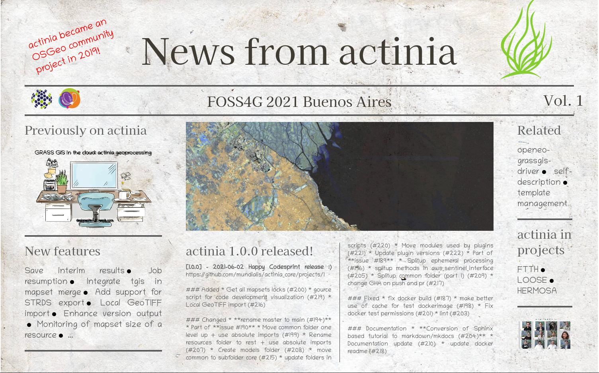

# Conclusions and future

<!--
(duration: 15 min incl discussions)
-->

* Discussion!
* Where is the code and how to contribute: find it on GitHub
    * [https://github.com/mundialis/actinia_core/](https://github.com/mundialis/actinia_core/)

## UPCOMING

### FOSS4G 2022 talk "News from actinia - let`s STAC!"
2022-08-24, 15:15–15:45, Room Onice

 

### FOSS4G 2022 OSGeo Community sprint

* [details in OSGeo Wiki](https://wiki.osgeo.org/wiki/FOSS4G_2022/Community_sprint)

## See also

### What does actinia mean?

Actinia is a beautiful sea creature and a genus of sea anemones in the family Actiniidae (see [wikipedia](https://en.wikipedia.org/wiki/Actinia)). While the sea creature is filtering the sea water, the [actinia geoprocessing platform](https://actinia.mundialis.de/) filters in large data oceans.

### How to contribute to actinia

Please see [CONTRIBUTING.md](https://github.com/mundialis/actinia_core/blob/master/CONTRIBUTING.md)

### openEO resources

* OpenEO Web Editor: [https://open-eo.github.io/openeo-web-editor/demo/](https://open-eo.github.io/openeo-web-editor/demo/)
    * Server: [https://openeo.mundialis.de](https://openeo.mundialis.de)
    * user, password: upon request

## actinia, plugins and related repositories

* [actinia_core](https://github.com/mundialis/actinia_core)
* [actinia-module-plugin](https://github.com/mundialis/actinia-module-plugin)
* [actinia-metadata-plugin](https://github.com/mundialis/actinia-metadata-plugin)
* [actinia_satellite_plugin](https://github.com/mundialis/actinia_satellite_plugin)
* [actinia_statistic_plugin](https://github.com/mundialis/actinia_statistic_plugin)
* [actinia-stac-plugin](https://github.com/mundialis/actinia-stac-plugin)
* [ace](https://github.com/mundialis/ace)
* [exporter](https://github.com/mundialis/exporter)
* [importer](https://github.com/mundialis/importer)
* [helm charts](https://github.com/mundialis/helm-charts/tree/main/charts)
* [openeo-grassgis-drives](https://github.com/Open-EO/openeo-grassgis-driver)

### REST introduction

* What is REST - A Simple Explanation for Beginners, [Part 1: Introduction](https://medium.com/extend/what-is-rest-a-simple-explanation-for-beginners-part-1-introduction-b4a072f8740f)
* What is REST - A Simple Explanation for Beginners, [Part 2: REST Constraints](https://medium.com/extend/what-is-rest-a-simple-explanation-for-beginners-part-2-rest-constraints-129a4b69a582)

### Using command line on Windows

* [Git for Windows](https://gitforwindows.org/) offers the "git bash" and common tools
* [MSYS2](https://www.msys2.org/) offers a bash and many tools along with `pacman` to install further packages

## References

[1] Zell Liew, 2018: Understanding And Using REST APIs, [https://www.smashingmagazine.com/2018/01/understanding-using-rest-api/](https://www.smashingmagazine.com/2018/01/understanding-using-rest-api/)

[2] Planet 2019: Developer resource center, [https://developers.planet.com/planetschool/rest-apis/](https://developers.planet.com/planetschool/rest-apis/)

[3] [actinia API reference](https://redocly.github.io/redoc/?url=https://actinia.mundialis.de/api/v3/swagger.json) documentation

[4] actinia article: 

## Acknowledgement

The review by [Vero Andreo](https://veroandreo.gitlab.io/) is greatly appreciated.

As already mentioned above, this workshop is a fork of [an actinia workshop](https://neteler.gitlab.io/actinia-introduction) by Markus Neteler. Main content was reused, some adjustments were made.

Last but not least thanks to Anika Weinmann for creating the documentation about actinia Connector and - in teamwork together with Guido Riembauer -
for updating the excercises and creating new fun and smaller tasks.

------------------------------------------------------------------------

- Repository of this material on [github](https://github.com/mundialis/actinia-introduction/)

*[About](about.md) | [Privacy](https://docs.github.com/en/github/site-policy/github-privacy-statement)*
