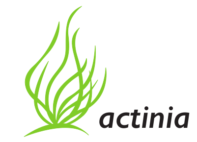
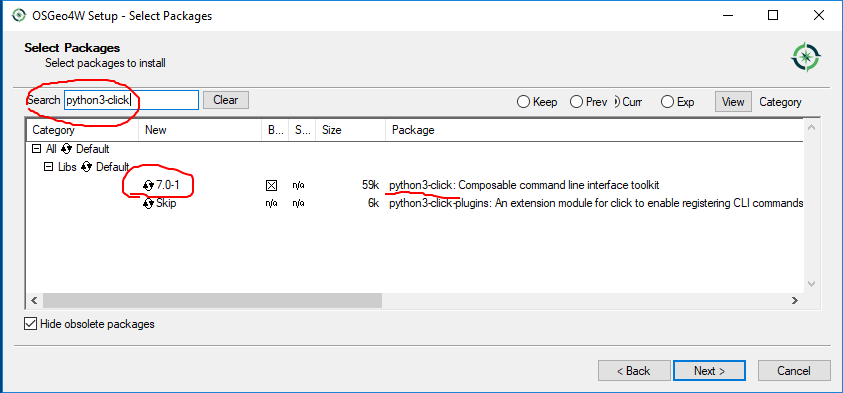
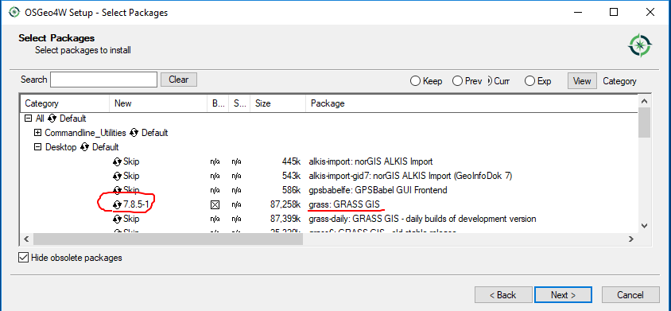
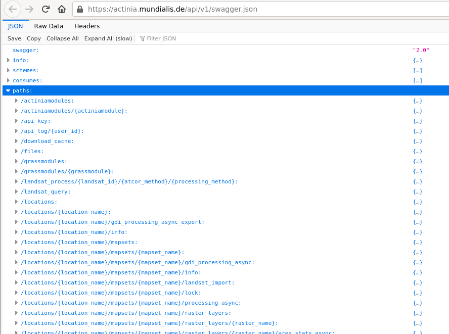
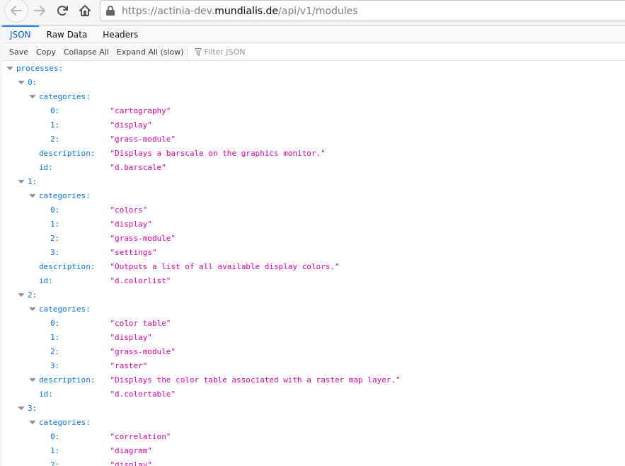
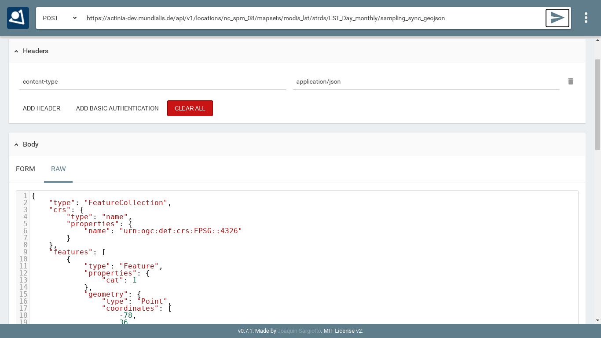

# A gentle introduction to actinia

Author: Markus Neteler, mundialis GmbH & Co. KG, Bonn

<!-- **** Begin Fork-Me-On-Gitlab-Ribbon-HTML. See MIT License at https://gitlab.com/seanwasere/fork-me-on-gitlab **** -->
<a href="https://gitlab.com/neteler/actinia-introduction/">
    <span style="font-family: tahoma; font-size: 18px; position:fixed; top:50px; right:-45px; display:block; -webkit-transform: rotate(45deg); -moz-transform: rotate(45deg); background-color:green; color:white; padding: 4px 30px 4px 30px; z-index:99; opacity:0.6">Fork Me On GitLab</span>
</a>
<!-- **** End Fork-Me-On-Gitlab-Ribbon-HTML **** -->


URL of this dcument: [https://neteler.gitlab.io/actinia-introduction/](https://neteler.gitlab.io/actinia-introduction/)

*Last update: 5 Feb 2021*

## Abstract



Actinia ([https://actinia.mundialis.de/](https://actinia.mundialis.de/)) is an open source REST API for scalable, distributed, high performance processing of geographical data that uses mainly GRASS GIS for computational tasks. Core functionality includes the processing of single and time series of satellite images, of raster and vector data. With the existing (e.g. Landsat) and Copernicus Sentinel big geodata pools which are growing day by day, actinia is designed to follow the paradigm of bringing algorithms to the cloud stored geodata. Actinia is an OSGeo Community Project since 2019.

In this course we will briefly give a short introduction to REST API and cloud processing concepts. This is followed by an introduction to actinia processing along with hands-on to get more familiar with the topic by exercises.

[](https://doi.org/10.5281/zenodo.2631917)

## Required software for this tutorial

We will use a browser plugin to try out some REST commands. Then we'll also use GRASS GIS and a special command to control actinia from remote. This requires some software to be installed:

* REST client (browser plugin):
    * [cURL](https://curl.haxx.se/docs/manpage.html), to be used on command line
    * optionally: Chrome/Chromium browser:
        * with RESTman extension: [https://chrome.google.com/webstore/detail/restman/ihgpcfpkpmdcghlnaofdmjkoemnlijdi](https://chrome.google.com/webstore/detail/restman/ihgpcfpkpmdcghlnaofdmjkoemnlijdi)
* For the "ace - actinia command execution" section:
    * GRASS GIS 7.8+ ([download](https://grass.osgeo.org/download/))
    * three additional Python packages:
        * Linux: `pip3 install click requests simplejson`
        * Windows users (Installer: [OSGeo4W](https://trac.osgeo.org/osgeo4w/) > Advanced installation > Search window):
            * python3-click, python3-requests, python3-simplejson
    * ace - [actinia command execution](https://github.com/mundialis/actinia_core/blob/master/scripts/README.md) (to be run from a GRASS GIS session; installation shown below)
    * [jq, a lightweight and flexible command-line JSON processor](https://stedolan.github.io/jq/download/)

<center>
<a href="img/osgeo4w_python_libs.png"></a> &nbsp; &nbsp;
<a href="img/osgeo4w_grass78.png"></a>
</center>

Note: We will use the demo actinia server at [https://actinia.mundialis.de/](https://actinia.mundialis.de/) - hence Internet connection is required.

## actinia tutorial overview

**Content**

* Warming up
* Introduction
    * Why cloud computing?
    * Overview actinia
* REST API and geoprocessing basics
    * What is REST: intro
* First Hand-on: working with REST API requests
    * Step by step...
* Exploring the API: finding available actinia endpoints
    * REST actinia examples with curl
* Controlling actinia from a running GRASS GIS session
    * Further command line exercise suggestions
* Own exercises in actinia
* Conclusions and future
* See also: openEO resources
* References
* About the trainer

## Warming up

A graphical intro to actinia - [GRASS GIS in the cloud: actinia geoprocessing](https://mundialis.github.io/foss4g2019/grass-gis-in-the-cloud-actinia-geoprocessing/index.html) (note: requires Chrome/ium browser)

## Introduction

<!--
(10 min)
-->

For this tutorial we assume working knowledge concerning **geospatial analysis and Earth observation.** The tutorial includes, however, a brief introduction to **REST** (Representational State Transfer) API and cloud processing related basics.

<!--
### Geo and EO basics

* geodata layers
    * raster
    * vector
    * timeseries of both
    * image data (aerial, drone, satellite, ...)
* single and multispectral data (2-D arrays of reflectance values)
-->

### Why cloud computing ?

With the tremendous increase of available geospatial and Earth observation lately driven by the Copernicus programme (esp. Sentinel satellites) and increasing availability of open data the need for computational resources is growing in a non-linear way.

Cloud technology offers a series of **advantages**:

* scalable, distributed, and high performance processing
* large quantities of Earth Observation (EO) and geodata provided in dedicated cloud infrastructures
* addressing the paradigm of computing next to the data
* no need to bother yourself with the low-level management of petabytes of data

Still, some critical **issues** have to be addressed:

* lack of Analysis-Ready-data (ARD) available for consumption in the cloud
* lack of compatibility between different data systems
     * we are on it: the [openEO H2020 project](https://openeo.org)
 * lack of cloud abstraction, for easier move between vendors and providers

### Overview actinia

Actinia ([https://actinia.mundialis.de/](https://actinia.mundialis.de/)) is an **open source REST API for scalable, distributed, high performance processing of geospatial and Earth observation data** that uses mainly GRASS GIS for computational tasks. Core functionality includes the processing of single and time series of satellite images, of raster and vector data. With the existing (e.g. Landsat) and Copernicus Sentinel big geodata pools which are growing day by day, actinia is designed to follow the paradigm of bringing algorithms to the cloud stored geodata. Actinia is an OSGeo Community Project since 2019. The source code is available on GitHub at [https://github.com/mundialis/actinia_core](https://github.com/mundialis/actinia_core). It is written in Python and uses Flask, Redis, and other components.

**Functionality beyond GRASS GIS**

Actinia is not only a REST interface to GRASS GIS, but it offers through wrapping the possibility to extend its functionality with other software (ESA SNAP, GDAL, ...). To integrate other than GRASS GIS software, a wrapper script is to be written (style: as a GRASS GIS Addon Python script) which then includes the respective function calls of the software to be integrated.

**Persistent and ephemeral databases**

**Persistent storage** refers to a data store that retains data even in the event of a power-off, as well as retaining it without a scheduled deletion time. In the geo/EO context, persistent storage is used to provide, for example, base cartography, i.e. elevation models, road networks, building footprints, etc.

The **ephemeral storage** is used for on demand computed results including user generated data and temporary data as occurring in processing chains. In an ephemeral storage data are only kept for a limited period of time (e.g., in actinia, for 24 hs by default).

In the cloud computing context these differences are relevant as cost incurs when storing data.

Accordingly, actinia offers two modes of operation: persistent and ephemeral processing. In particular, the **actinia server** is typically deployed on a server with access to a persistent GRASS GIS database (PDB) and optionally to one or more GRASS GIS user databases (UDB).

The actinia server has access to compute nodes (**actinia nodes**; separate physically distinct machines) where the actual computations are performed. The actinia server acts as a **load balancer**, distributing jobs to actinia nodes. Results are either stored in GRASS UDBs in GRASS native format or directly exported to a different data format (see Fig. 1).

<center>
<a href="img/actinia_PDB_UDB.png"></a><br>
Fig. 1: Architecture of an actinia deployment (source: [mundialis FTTH talk 2019](https://mundialis.github.io/foss4g2019/digging_earth_ftth_grass_actinia/2019_foss4g_bucharest_digging_earth_ftth_grass_actinia.pdf) )
</center>

**Deployment**

In short, deployment means starting software, usually in an automated way on one or more computer nodes. There are a number of technologies for this. In particular, virtualisation plays an important role here, which avoids a high dependency on hardware and software characteristics through abstraction.

An aim is to operate **Infrastructure as Code** ([IaC](https://en.wikipedia.org/wiki/Infrastructure_as_code)), i.e. to have a set of scripts which order the needed computational resources in the cloud, setup the network and storage topology, connect to the nodes, install them with the needed software (usually docker based, i.e. so-called containers are launched from prepared images) and processing chains. Basically, the entire software part of a cloud computing infrastructure is launched "simply" through scripts with the advantage of restarting it easily as needed, maintain it and migrate to other hardware.

**CI/CD** systems (continuous integration/continuous deployment) allow to define dependencies, prevent from launching broken software and allow the versioning of the entire software stack.

With respect to actinia, **various ways of [deployment](https://github.com/mundialis/actinia_core/tree/master/docker)** are offered: local installation, docker, docker-compose, docker-swarm, Openshift, and kubernetes.

**Architecture of actinia**

Several **components** play a role in a cloud deployment of actinia (for an example, see Fig. 2):

* analytics: this are the workers of GRASS GIS or wrapped other software,
* external data sources: import providers for various external data sources,
* interface layer:
    * most importantly, the **REST API**,
    * [openEO GRASS GIS driver](https://github.com/Open-EO/openeo-grassgis-driver),
    * ace - [actinia command execution](https://github.com/mundialis/ace) (to be run in a GRASS GIS session),
* GDI management: actinia-gdi helps integrating actinia-core in an existing GDI including process-chain manipulation and job management, through [actinia-GDI](https://github.com/mundialis/actinia-gdi),
* metadata management: interface to GNOS via OGC-CSW, managed through [actinia-metadata-plugin](https://github.com/mundialis/actinia-metadata-plugin),
* module self-description and process-chain-template management and processing, managed through [actinia-module-plugin](https://github.com/mundialis/actinia-module-plugin),
* database system:
    * job management in a Redis database,
    * the GRASS GIS database (here are the geo/EO data stored!),
* connection to OGC Web services for output:
   * Geoserver integration (forthcoming).

<center>
<a href="img/actinia_architecture_FTTH.png"></a><br>
Fig. 2: Architecture of an actinia deployment (source: Carmen Tawalika)
</center>

## REST API and geoprocessing basics

<!--
(20 min)
-->

### What is REST: intro

An **API** (Application Programming Interface) defines a way of communicating between different software applications. A **RESTful** API (Representational State Transfer - REST, for details see [https://en.wikipedia.org/wiki/Representational_state_transfer](https://en.wikipedia.org/wiki/Representational_state_transfer)) is a web API for creating web services that communicate with web resources.

In detail, a REST API uses URL arguments to specify what information shall be returned through the API. This is not much different from requesting a Web page in a browser but through the REST API we can **execute commands remotely and retrieve the results**.

Each URL is called a **request** while the data sent back to the user is called a **response**, after some **processing** was performed.

There are two types of request: **synchronous** and **asynchronous**. In the case of a synchronous request, the client sends it to the server and waits for a response. In geospatial computing, processing can take some time, which would block the client because it is only waiting. To avoid this, there is also the asynchronous request type. Here the client does not wait directly for a response, but checks from time to time whether the job has been completed (by "polling").

<!--
###  Concepts of service URL, resources, request, response...

Looking in further detail into REST calls, we see that an API request consists of three parts (source: [https://www.earthdatascience.org/courses/earth-analytics/get-data-using-apis/intro-to-programmatic-data-access-r/](https://www.earthdatascience.org/courses/earth-analytics/get-data-using-apis/intro-to-programmatic-data-access-r/)):
*   Data **request**: through this you try to access an URL using your browser that specifies a particular subset of data.
*   Data **processing:** A web server somewhere uses that URL to query a specified dataset.
*   Data **response**: The web server then sends back some content to you.
-->

A **request** consists of four parts (see also [1]):

* the endpoints
* the header
* the data (or body)
* the methods

**Endpoint:**

In general, an endpoint is an entry point to a service, a process, or a queue or topic destination in service-oriented architecture. In the case of actinia, it may be a data query function, the computation of a vegetation index, the deletion of a dataset, and more.
Effectively, an endpoint is the URL you request for. It follows this structure: https://api.some.server/endpoint
The final part of an endpoint is query parameters. Using query parameters you can modify your request with key-value pairs, beginning with a question mark (`?`). With an ampersand (`&`) each parameter pair is separated, e.g.:

`?query1=value1&query2=value2`

As an example, we check the repositories of a GitHub user, in sorted form, using the `repos` endpoint + query:

[https://api.github.com/users/neteler/repos?sort=pushed](https://api.github.com/users/neteler/repos?sort=pushed)

**Header & Body:**

* Both requests and responses have two parts: a header, and optionally a body.
* Response headers contain information about the response.
* In both requests & responses, the body contains the actual data being transmitted (e.g., population data).

**Methods and Response Codes:**

Request **methods** (source: [2]):

* In REST APIs, every request has an HTTP method type associated with it.
* The most common HTTP methods (or verbs) include:
    * `GET` - a GET request asks to receive a copy of a resource
    * `POST` - a POST request sends data to a server in order to change or update resources
    * `PUT` - a PUT request sends data to a server in order to replace existing or create new resources
    * `DELETE` - a DELETE request is sent to remove or destroy a resource

Response **codes**:

* HTTP responses don't have methods, but they do have status codes: HTTP status codes are included in the header of every response in a REST API. Status codes include information about the result of the original request.
* Selected status codes (see also [https://httpstatuses.com](https://httpstatuses.com)):
    * 200 - OK | All fine
    * 404 - Not Found | The requested resource was not found
    * 401 - Unauthorized | The request was rejected, as the sender is not (or wrongly) authorized
    * 500 - Internal Server Error | Something went wrong while the server was processing your request

**JSON format**

JSON is a structured, machine readable format (while also human readable at the same time; in contrast to XML, at least for many people). [JSON](https://json.org/) is short for JavaScript Object Notation.

```bash
# this command line call...
GRASS 7.8.git (nc_spm_08):~ > v.buffer input=roadlines output=roadbuf10 distance=10 --json
```

... looks like the following in JSON:

```json
{
  "module": "v.buffer",
  "id": "v.buffer_1804289383",
  "inputs":[
     {"param": "input", "value": "roadlines"},
     {"param": "layer", "value": "-1"},
     {"param": "type", "value": "point,line,area"},
     {"param": "distance", "value": "10"},
     {"param": "angle", "value": "0"},
     {"param": "scale", "value": "1.0"}
   ],
  "outputs":[
     {"param": "output", "value": "roadbuf10"}
   ]
}
```

Hint: When writing JSON files, some linting (syntax validation) might come handy, e.g. using [https://jsonlint.com/](https://jsonlint.com/).

## First Hand-on: working with REST API requests

<!--
(50 min)
-->

### Step by step...

Step 1:

* get your credentials (for authentication) from the trainer (or simply use the "demouser" with "gu3st!pa55w0rd")

Step 2:

* choose and launch your REST client: cURL or RESTman or ...
    * a) [cURL](https://curl.haxx.se/docs/manpage.html), on command line
    * b) [RESTman](https://chrome.google.com/webstore/detail/restman/ihgpcfpkpmdcghlnaofdmjkoemnlijdi) ([manual](https://github.com/jsargiot/restman)), in Browser
* Try this call: [https://actinia.mundialis.de/api/v1/locations](https://actinia.mundialis.de/api/v1/locations)

<center>
<a href="img/actinia_restman01.png"></a><br>
<a href="img/actinia_restman02.png"></a><br>
Fig. 3: Using RESTman
</center>

For a `curl` example, see below ("REST actinia examples with curl").

Step 3:

* Explore the existing data on the actinia server:
    * i.e., available GRASS locations, mapsets, raster, vector, and space-time datasets
    * Check the [list of data](https://github.com/mundialis/actinia_core/blob/master/scripts/README.md#available-data) currently available on the actinia server
    * e.g.
        * [https://actinia.mundialis.de/api/v1/locations](https://actinia.mundialis.de/api/v1/locations)
        * [https://actinia.mundialis.de/api/v1/locations/nc_spm_08/mapsets](https://actinia.mundialis.de/api/v1/locations/nc_spm_08/mapsets)
        * [https://actinia.mundialis.de/api/v1/locations/nc_spm_08/mapsets/landsat/raster_layers](https://actinia.mundialis.de/api/v1/locations/nc_spm_08/mapsets/landsat/raster_layers)
        * [https://actinia.mundialis.de/api/v1/locations/nc_spm_08/mapsets/landsat/raster_layers/lsat5_1987_10](https://actinia.mundialis.de/api/v1/locations/nc_spm_08/mapsets/landsat/raster_layers/lsat5_1987_10)
    * process_results are ordered alphabetically, not thematically

Step 4:

* Submit a compute job and check its status (in case of asynchronous jobs, by polling).

## Exploring the API: finding available actinia endpoints

The actinia REST API documentation at [https://redocly.github.io/redoc/?url=https://actinia.mundialis.de/api/v1/swagger.json](https://redocly.github.io/redoc/?url=https://actinia.mundialis.de/api/v1/swagger.json) comes with a series of examples.

Check out the various sections in the actinia API docs:

* Authentication Management
* API Log
* Cache Management
* Satellite Image Algorithms
* Location Management
* Mapset Management
* Processing
* Raster Management
* Raster Statistics
* STRDS Management (STRDS = space-time raster data set)
* STRDS Sampling
* STRDS Statistics
* Vector Management
* Resource Management

List of endpoints shown in the web browser:

* To see a simple **list of endpoints** (and more), see the "paths" section in the [API JSON](https://actinia.mundialis.de/api/v1/swagger.json).

<center>
<a href="img/actinia_swagger_paths.png"></a><br>
Fig. 4: actinia list of endpoints (in "paths" section)
</center>

* List of supported processes (> 500): see [API modules](https://actinia-dev.mundialis.de/api/v1/modules) (note: the process chain templates are at bottom, category "actinia-module")

<center>
<a href="img/actinia_modules.png"></a><br>
Fig. 5: actinia list of GRASS GIS processes (> 500)
</center>

List of endpoints shown on command line:

* To get the available endpoints on command line, run

```bash
# sudo npm install -g json
curl -X GET https://actinia.mundialis.de/api/v1/swagger.json | json paths | json -ka
```

### REST actinia examples with curl

Here we use the command line and the `curl` software to communicate with the actinia server.
Optionally, to beautify the output, we use the `jq` command-line JSON processor which helps to turn the output into something human readable ([download jq](https://stedolan.github.io/jq/download/)).

Hint: If you have troubles to use `jq` on command line, you can also use it in a browser at [https://jqplay.org/](https://jqplay.org/): copy the JSON code into the "JSON" field, then a `.` into the "Filter" field and it with show the result.

**Preparation:**

```bash
# set credentials and REST server URL
export actinia="https://actinia.mundialis.de"
export AUTH='-u demouser:gu3st!pa55w0rd'
```

**List locations:**

```bash
# show available locations (locations are like projects)
curl ${AUTH} -X GET ${actinia}/api/v1/locations
```

**Show capabilities of user:**

```bash
# NOTE: endpoint not available to the demouser but only to the admin user
# show accessible_datasets, accessible_modules, raster cell_limit, process_num_limit, process_time_limit
curl ${AUTH} -X GET "${actinia}/api/v1/users/demouser"
```

**List mapsets in locations:**

```bash
# show available mapsets of a specific location
curl ${AUTH} -X GET "${actinia}/api/v1/locations/nc_spm_08/mapsets"
```

Note the output difference:

```bash
# show available mapsets of a specific location
curl ${AUTH} -X GET "${actinia}/api/v1/locations/nc_spm_08/mapsets | jq"
```

**List map layers and their metadata:**

```bash
# show available vector maps in a specific location/mapset
curl ${AUTH} -X GET "${actinia}/api/v1/locations/nc_spm_08/mapsets/PERMANENT/vector_layers"
curl ${AUTH} -X GET "${actinia}/api/v1/locations/nc_spm_08/mapsets/PERMANENT/vector_layers" | jq

# note: you can always add `| jq`

# show metadata of a specific vector map
curl ${AUTH} -X GET "${actinia}/api/v1/locations/nc_spm_08/mapsets/PERMANENT/vector_layers/geology"

# show available raster maps in a specific location/mapset
curl ${AUTH} -X GET "${actinia}/api/v1/locations/nc_spm_08/mapsets/PERMANENT/raster_layers"
curl ${AUTH} -X GET "${actinia}/api/v1/locations/nc_spm_08/mapsets/landsat/raster_layers"
curl ${AUTH} -X GET "${actinia}/api/v1/locations/nc_spm_08/mapsets/modis_lst/raster_layers"

# show metadata of a specific raster map
curl ${AUTH} -X GET "${actinia}/api/v1/locations/nc_spm_08/mapsets/landsat/raster_layers/lsat7_2000_40"

# show available STRDS in a specific location/mapset
# STRDS = space time raster data set
curl ${AUTH} -X GET "${actinia}/api/v1/locations/nc_spm_08/mapsets/modis_lst/strds"

# show specific STRDS in a specific location/mapset
curl ${AUTH} -X GET "${actinia}/api/v1/locations/latlong_wgs84/mapsets/modis_ndvi_global/strds/ndvi_16_5600m"

# Get a list or raster layers from a STRDS
curl ${AUTH} -X GET "${actinia}/api/v1/locations/ECAD/mapsets/PERMANENT/strds/precipitation_1950_2013_yearly_mm/raster_layers"

# Get a list or raster layers from a STRDS, with date filter
curl ${AUTH} -X GET "${actinia}/api/v1/locations/ECAD/mapsets/PERMANENT/strds/precipitation_1950_2013_yearly_mm/raster_layers?where=start_time>2012-01-01"
```

**Map layer queries:**

We query the Land Surface Temperature (LST) values in the space-time cube at a specific position (North Carolina data set; at [78W, 36N](https://www.openstreetmap.org/?mlat=36.00&mlon=-78.00#map=10/36.00/-78.00)), For this, we use the endpoint `sampling_sync_geojson`:

```bash
# query point value in a STRDS, sending the JSON code directly in request
# (North Carolina LST time series)
curl ${AUTH} -X POST -H "content-type: application/json" "${actinia}/api/v1/locations/nc_spm_08/mapsets/modis_lst/strds/LST_Day_monthly/sampling_sync_geojson" -d '{"type":"FeatureCollection","crs":{"type":"name","properties":{"name":"urn:ogc:def:crs:EPSG::4326"}},"features":[{"type":"Feature","properties":{"cat":1},"geometry":{"type":"Point","coordinates":[-78,36]}}]}'
```

Using RESTman you need to pay attention to these changes:

* change type of request from GET to POST, in the top of the page lefthand of the URL
* set the right header `content-type` and `application/json` as value
* add the JSON in the body section in RAW format

<center>
<a href="img/actinia_restman_post.png"></a><br>
Fig.6 RESTman POST request example (source: Luca Delucchi)
</center>
**Sending JSON payload as a file:**

It is often much more convenient to store the JSON payload in a file and send it to server:

```bash
# store query in a JSON file "pc_query_point_.json" (or use a text editor for this)
echo '{"type":"FeatureCollection","crs":{"type":"name","properties":{"name":"urn:ogc:def:crs:EPSG::4326"}},"features":[{"type":"Feature","properties":{"cat":1},"geometry":{"type":"Point","coordinates":[-78,36]}}]}' > pc_query_point_.json

# send JSON file as payload to query the STRDS
curl ${AUTH} -X POST -H "content-type: application/json" "${actinia}/api/v1/locations/nc_spm_08/mapsets/modis_lst/strds/LST_Day_monthly/sampling_sync_geojson" -d @pc_query_point_.json  | jq
```

**Validation of a process chain:**

Why validation? It may happen that your JSON file to be sent to the endpoint contains a typo or other invalid content. For the identification of problems prior to executing the commands contained in the JSON file (which may last for hours), it is recommended to validate this file.
For this, actinia can be used as it provides a validation endpoint.

Example: Download the process chain [process_chain_long.json](https://gitlab.com/neteler/actinia-introduction/raw/master/docs/process_chain_long.json) and validate it:

```bash
# validation of a process chain (using sync call)
curl ${AUTH} -H "Content-Type: application/json" -X POST "${actinia}/api/v1/locations/nc_spm_08/process_chain_validation_sync" -d @process_chain_long.json
```

**Converting a process chain back into commands:**

To turn a process chain back into a command style notation, the validator can be used for this as well and the relevant code extracted from the resulting JSON response.
Download the process chain [process_chain_long.json](https://gitlab.com/neteler/actinia-introduction/raw/master/docs/process_chain_long.json) and extract the underlying commands by parsing the response with `json`:

```bash
# command extraction from a process chain (using sync call) by parsing the 'process_results' response (here we use the `json` tool):
curl ${AUTH} -H "Content-Type: application/json" -X POST "${actinia}/api/v1/locations/nc_spm_08/process_chain_validation_sync" -d @process_chain_long.json | json process_results
[
  "grass g.region ['raster=elevation@PERMANENT', 'res=4', '-p']",
  "grass r.slope.aspect ['elevation=elevation@PERMANENT', 'format=degrees', 'precision=FCELL', 'zscale=1.0', 'min_slope=0.0', 'slope=my_slope', 'aspect=my_aspect', '-a']",
  "grass r.watershed ['elevation=elevation@PERMANENT', 'convergence=5', 'memory=300', 'accumulation=my_accumulation']",
  "grass r.info ['map=my_aspect', '-gr']"
]

```

### Data exchange: import and export

Actinia can import from external Web resources. use data in the actinia server (persistent and ephemeral storage) and make results available for download as Web resources.
Note that the download of Web resources provided by actinia requires authentication.

### Dealing with workflows (processing chains)

General procedure:

* prepare a processing chain,
* compare async versus sync REST API calls, decide which one to use,
    * See: [https://github.com/mundialis/actinia_core/blob/master/scripts/curl_commands.sh#L77](https://github.com/mundialis/actinia_core/blob/master/scripts/curl_commands.sh#L77)
* submit the processing chain to an actinia endpoint,
* retrieve the result(s).

To turn this into an example, we use again the process chain [process_chain_long.json](https://gitlab.com/neteler/actinia-introduction/raw/master/docs/process_chain_long.json) from above and execute it, here using the asynchonous `processing_async_export` endpoint. By this, the `exporter` in the process chain will be activated and deliver the computed maps as Web resources for subsequent download:

```bash
curl ${AUTH} -H "Content-Type: application/json" -X POST "${actinia}/api/v1/locations/nc_spm_08/processing_async_export" -d @process_chain_long.json 
```

Being an asynchronous process, the result is not offered directly but at the bottom of the JSON output (in the terminal) a Web resource is shown. Use this URI for retrieving the process status. Once completed, three Web resources (here: GeoTIFF) are displayed:

```bash
# update the URI to that of your job, and be sure to use https:
curl ${AUTH} -X GET "https://actinia.mundialis.de/api/v1/resources/demouser/resource_id-284d42c7-9ba7-415d-b675-cf1a534f4af0" | json

...
  "status": "finished",
  "time_delta": 3.7403182983398438,
  "timestamp": 1580767679.525925,
  "urls": {
    "resources": [
      "http://actinia.mundialis.de/api/v1/resources/demouser/resource_id-284d42c7-9ba7-415d-b675-cf1a534f4af0/my_slope.tiff",
      "http://actinia.mundialis.de/api/v1/resources/demouser/resource_id-284d42c7-9ba7-415d-b675-cf1a534f4af0/my_aspect.tiff",
      "http://actinia.mundialis.de/api/v1/resources/demouser/resource_id-284d42c7-9ba7-415d-b675-cf1a534f4af0/my_accumulation.tiff"
    ],
    "status": "http://actinia.mundialis.de/api/v1/resources/demouser/resource_id-284d42c7-9ba7-415d-b675-cf1a534f4af0"
  },
  "user_id": "demouser"
}
```

The resulting files can now be downloaded (they'll remain for 24 hs on the server).

<center>
<a href="img/qgis_actinia_data_viz.png"></a><br>
Fig. 7: actinia output shown in QGIS (aspect map)
</center>

## Controlling actinia from a running GRASS GIS session

Controlling actinia from a running GRASS GIS session is a convenient way of writing process chains. It requires some basic GRASS GIS knowledge (for intro course, see [here](https://neteler.gitlab.io/grass-gis-analysis/).

The "ace" - actinia command execution from a GRASS GIS terminal is a wrapper tool written in Python which simplifies the writing of processing chains notably.

To try it out, start GRASS GIS with the `nc_spm_08` North Carolina sample location. You can download it easily through the `Download` button in the graphical startup (recommended; see Fig. 7) or from [grass.osgeo.org/download/sample-data/](https://grass.osgeo.org/download/sample-data/).

<center>
<a href="img/grass78_download_NC_location.png"></a><br>
Fig. 8: Download and extraction of `nc_spm_08` North Carolina sample location ("Complete NC location")
</center>

Before starting GRASS GIS with the downloaded location create a new mapset "ace" in `nc_spm_08`.

<p style="border:lightgreen solid 5px;padding:5px; width:50%">
Note: Since we want to do cloud computing, the full location would not be needed but it is useful to have for an initial exercise in order to compare local and remote computations.
</p>

**Needed Python libraries**

In case not yet present on the system, the following Python libraries are needed:

* Linux: `pip3 install click requests simplejson`
* Windows users (Installer: [https://trac.osgeo.org/osgeo4w/](OSGeo4W) > Advanced installation > Search window):
    * three Python packages: python3-click, python3-requests, python3-simplejson

**Installation of ace tools**

You need to be in a running GRASS GIS session:


```bash
# actinia importer installation
g.extension extension=importer url=https://github.com/mundialis/importer

# actinia exporter installation
g.extension extension=exporter url=https://github.com/mundialis/exporter

# ace (actinia command execution) tool
g.extension extension=ace url=https://github.com/mundialis/ace
```

To explore the `ace` tool, follow the usage examples found here:

[https://github.com/mundialis/actinia_core/blob/master/scripts/README.md](https://github.com/mundialis/actinia_core/blob/master/scripts/README.md)


### Further command line exercise suggestions

For this you can either use "ace" or write with an editor the JSON process chains and send them to actinia.

**Computations using data in the `nc_spm_08` location:**

* compute NDVI from a Landsat scene (using `i.vi`)
* slope and aspect from a DEM (there are several;  using `r.slope.aspect`)
* flow accumulation with `r.watershed` from a DEM
* buffer around hospitals  (using `v.buffer`)
* advanced: network allocation with hospitals and streets_wake (using `v.net.alloc`)
* generalizing vector polygons with GRASS GIS' topology engine (using `v.generalize`)

**Further examples incl. Spatio-Temporal sampling:**

See: [https://github.com/mundialis/actinia_core/blob/master/scripts/curl_commands.sh](https://github.com/mundialis/actinia_core/blob/master/scripts/curl_commands.sh)


## Own exercises in actinia

<!--
(40 min)
-->

**EXERCISE: "Population at risk near coastal areas"**

* needed geodata:
    * SRTM 30m (already available in actinia - find out the location yourself)
    * Global Population 2015 (already available in actinia - find out the location yourself)
    * vector shorelines (get from [naturalearthdata](http://www.naturalearthdata.com/downloads/))
* fetch metadata with actinia interface
* before doing any computations: what's important about projections?
* proposed workflow:
    * set computational region to a small subregion and constrain the pixel number through defined user settings
    * buffer SRTM land areas by 5000 m inwards
    * zonal statistics with population map

**EXERCISE: "Property risks from trees"**

(draft idea only, submit your suggestion to trainer how to solve this task)

* define your region of interest
* needed geodata:
    * building footprints
        * download from OSM (via [https://overpass-turbo.eu/](https://overpass-turbo.eu/) | Wizard > building > ok > Export > Geojson)
        * these data are now on your machine and not on the actinia server
        * use "ace importer" or cURL to upload
    * select Sentinel-2 scene
* proposed workflow:
    * actinia "ace" importer for building footprint upload
    * `v.buffer` of 10m and 30m around footprints
    * select S2 scene, compute NDVI with `i.vi`
    * filter NDVI threshold > 0.6 (map algebra) to get the tree pixels - more exiting would be a ML approach (with previously prepared training data ;-)) (`r.learn.ml` offers RF and SVM)
    * on binary tree map (which corresponds to risk exposure)
    * count number of tree pixels in 5x5 moving window (`r.neighbors` with method "count")
    * compute property risk statistics using buffers and tree count map and upload to buffered building map (`v.rast.stats`, method=maximum)
    * export of results through REST resources

## Conclusions and future

<!--
(15 min incl discussions)
-->

* integration in own scientific or business processes
* openEO actinia driver
* where is the code and how to contribute: find it on GitHub
    * [https://github.com/mundialis/actinia_core/](https://github.com/mundialis/actinia_core/)

## See also: openEO resources

* OpenEO Web Editor: [https://open-eo.github.io/openeo-web-editor/demo/](https://open-eo.github.io/openeo-web-editor/demo/)
    * Server: [https://openeo.mundialis.de](https://openeo.mundialis.de)
    * user: 'actinia_user'
    * pw: 'actinia_pw'

## References

[1] Zell Liew, 2018: Understanding And Using REST APIs, [https://www.smashingmagazine.com/2018/01/understanding-using-rest-api/](https://www.smashingmagazine.com/2018/01/understanding-using-rest-api/)

[2] Planet 2019: Developer resource center, [https://developers.planet.com/planetschool/rest-apis/](https://developers.planet.com/planetschool/rest-apis/)

[3] [actinia API reference](https://redocly.github.io/redoc/?url=https://actinia.mundialis.de/api/v1/swagger.json) documentation

[4] actinia paper: [](https://doi.org/10.5281/zenodo.2631917)]


------------------------------------------------------------------------

- Repository of this material on [gitlab](https://gitlab.com/neteler/actinia-introduction/)


*[About](about.md) | [Privacy](https://about.gitlab.com/privacy/)*
