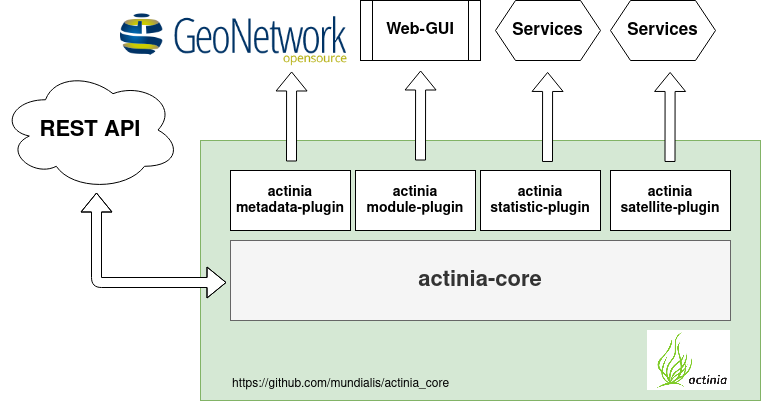
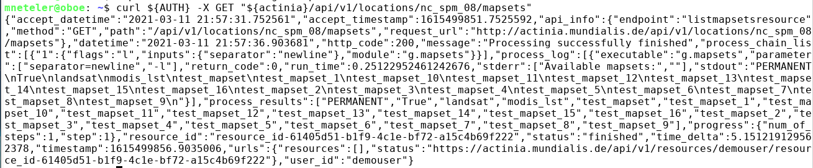
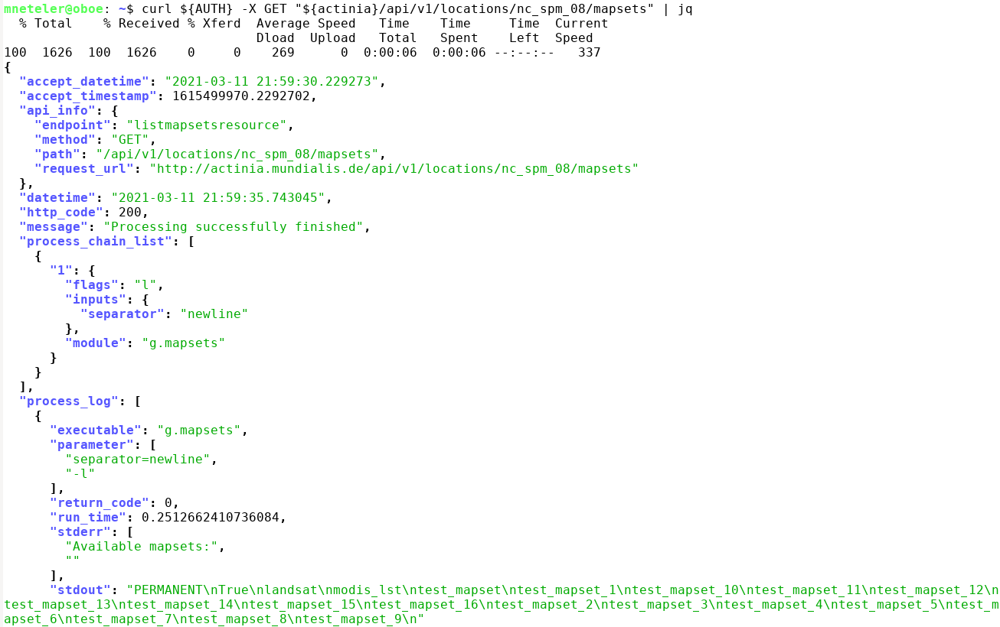
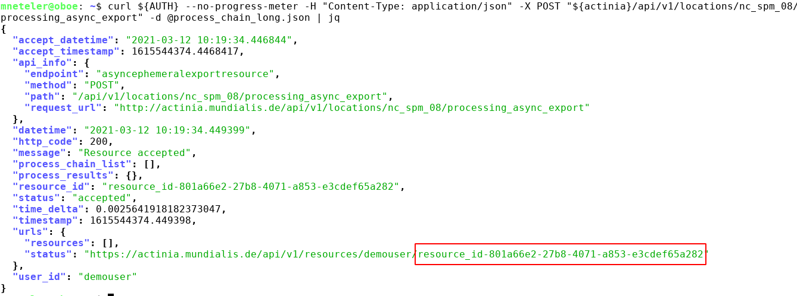
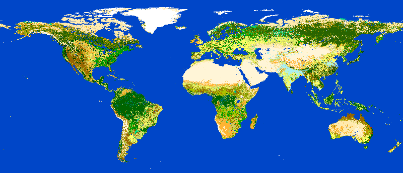

# A gentle introduction to actinia

Author: Markus Neteler, mundialis GmbH & Co. KG, Bonn

<!-- **** Begin Fork-Me-On-Gitlab-Ribbon-HTML. See MIT License at https://gitlab.com/seanwasere/fork-me-on-gitlab **** -->
<a href="https://gitlab.com/neteler/actinia-introduction/">
    <span style="font-family: tahoma; font-size: 18px; position:fixed; top:50px; right:-45px; display:block; -webkit-transform: rotate(45deg); -moz-transform: rotate(45deg); background-color:green; color:white; padding: 4px 30px 4px 30px; z-index:99; opacity:0.6">Fork Me On GitLab</span>
</a>
<!-- **** End Fork-Me-On-Gitlab-Ribbon-HTML **** -->


URL of this dcument: [https://neteler.gitlab.io/actinia-introduction/](https://neteler.gitlab.io/actinia-introduction/)

*Last update: 24 Mar 2021*

## Abstract


Actinia ([https://actinia.mundialis.de/](https://actinia.mundialis.de/)) is an open source REST API for scalable, distributed, high performance processing of geographical data that uses mainly GRASS GIS for computational tasks. Core functionality includes the processing of single scenes and time series of satellite images, of raster and vector data. With the existing (e.g. Landsat) and Copernicus Sentinel big geodata pools which are growing day by day, actinia is designed to follow the paradigm of bringing algorithms to the cloud stored geodata. Actinia is an OSGeo Community Project since 2019.

In this course we will briefly give a short introduction to REST API and cloud processing concepts. This is followed by an introduction to actinia processing along with hands-on to get more familiar with the topic by means of exercises.

[](https://doi.org/10.5281/zenodo.2631917)

## Required software for this tutorial

We will use a browser plugin to try out some REST commands. Then we'll also use GRASS GIS and a special command to control actinia from remote. This requires some software to be installed:

* REST client (command line tool or browser plugin):
    * [cURL](https://curl.haxx.se/docs/manpage.html), to be used on command line
    * Extensions for Chrome/Chromium browser:
        * [RESTman extension](https://chrome.google.com/webstore/detail/restman/ihgpcfpkpmdcghlnaofdmjkoemnlijdi)
        * and a nice [JSON Formatter](https://chrome.google.com/webstore/detail/json-formatter/bcjindcccaagfpapjjmafapmmgkkhgoa)
* For the "ace - actinia command execution" section:
    * GRASS GIS 7.8+ ([download](https://grass.osgeo.org/download/))
    * three additional Python packages:
        * Linux: `pip3 install click requests simplejson`
        * Windows users (Installer: [OSGeo4W](https://trac.osgeo.org/osgeo4w/) > Advanced installation > Search window):
            * python3-click, python3-requests, python3-simplejson
    * ace - [actinia command execution](https://github.com/mundialis/actinia_core/blob/master/scripts/README.md) (to be run from a GRASS GIS session; installation shown below)
    * [jq, a lightweight and flexible command-line JSON processor](https://stedolan.github.io/jq/download/)
    * nice to have: <a href="https://www.qgis.org/en/site/forusers/download.html">QGIS</a>

<center>
<a href="img/osgeo4w_python_libs.png"></a> &nbsp; &nbsp;
<a href="img/osgeo4w_grass78.png"></a>
</center>

Note: We will use the demo actinia server at [https://actinia.mundialis.de/](https://actinia.mundialis.de/) - hence Internet connection is required.

## actinia tutorial overview

**Content**

* Warming up
* Introduction
    * Why cloud computing?
    * Overview actinia
* REST API and geoprocessing basics
    * What is REST: intro
* First Hand-on: working with REST API requests
    * Step by step...
* Exploring the API: finding available actinia endpoints
    * REST actinia examples with curl
* Controlling actinia from a running GRASS GIS session
    * Further command line exercise suggestions
* Own exercises in actinia
* Conclusions and future
* See also: openEO resources
* References
* About the trainer

## Warming up

<!--
(duration: 20 min)
-->

To make you familiar with a few concepts, let's take a look at the "graphical intro to actinia" - [GRASS GIS in the cloud: actinia geoprocessing](https://mundialis.github.io/foss4g2019/grass-gis-in-the-cloud-actinia-geoprocessing/index.html) (note: it requires the Chrome/ium browser; presentation provided by <a href="https://github.com/mmacata/">Carmen Tawalika</a>, mundialis).

<center>

</center>

## Introduction

<!--
(duration: 10 min)
-->

For this tutorial we assume working knowledge concerning **geospatial analysis and Earth observation** (i.e., geodata such as raster, vector, time series, and image data including aerial, drone, and satellite data).
The tutorial includes, however, a brief introduction to **REST** (Representational State Transfer) API basics and cloud processing related hints.

### Why cloud computing?

With the tremendous increase of available geospatial and Earth observation lately driven by the European <a href="https://www.copernicus.eu">Copernicus programme</a> (esp. the Sentinel satellites) and the increasing availability of open data, the need for computational resources is growing in a non-linear way.

Cloud technology offers a series of **advantages**:

* scalable, distributed, and high performance processing
* large quantities of Earth Observation (EO) and geodata provided in dedicated cloud infrastructures
* addressing the paradigm of computing next to the data
* no need to bother yourself with the low-level management of tons of data.

(Ideally) enjoy the **five V’s of big data**: Volume, velocity, variety, veracity and value.

Still, some critical **issues** have to be addressed in the geospatial realm:

* lack of Analysis-Ready-data (ARD) available for consumption in the cloud
* lack of compatibility between different data systems
    * btw., we are on it: the [openEO H2020 project](https://openeo.org)
* lack of cloud abstraction, needed for easier move between vendors and providers.

### Overview actinia

Actinia ([https://actinia.mundialis.de/](https://actinia.mundialis.de/)) is an **open source REST API for scalable, distributed, high performance processing of geospatial and Earth observation data** that uses mainly GRASS GIS for computational tasks. Core functionality includes the processing of single scenes and time series of satellite images, of raster and vector data. With the existing (e.g. Landsat) and Copernicus Sentinel big geodata pools which are growing day by day, actinia is designed to follow the paradigm of bringing algorithms to the cloud stored geodata. Actinia is an OSGeo Community Project since 2019. The source code is available on GitHub at [https://github.com/mundialis/actinia_core](https://github.com/mundialis/actinia_core). It is written in Python and uses Flask, Redis, and other components.

### Components of actinia

Actinia is composed of several components.

Core system:

* [actinia-core](https://github.com/mundialis/actinia_core/): an open source REST API for scalable, distributed and, high performance processing of geographical data that uses mainly GRASS GIS for computational tasks. It can be installed as is or enhanced with multiple plugins.

Plugins:

* [actinia-module-plugin](https://github.com/mundialis/actinia-module-plugin): contains module self-description and process-chain-template management and processing
* [actinia-metadata-plugin](https://github.com/mundialis/actinia-metadata-plugin): contains communication with a metadata catalog via OGC-CSW, in usage with GeoNetwork opensource
* [actinia-statistic-plugin](https://github.com/mundialis/actinia_statistic_plugin): designed for computing raster map and raster-time-series statistics for categorical and continuous data
* [actinia-satellite-plugin](https://github.com/mundialis/actinia_satellite_plugin): designed for efficient satellite data handling, especially Landsat and Sentinel-2 scenes

<center>
<a href="img/actinia_architecture.png"></a><br>
Fig. 1: Components of actinia (core and plugins)
</center>

**Functionality beyond GRASS GIS**

Actinia is not only a REST interface to GRASS GIS, but it offers the possibility to extend its functionality with other software (ESA SNAP, GDAL, ...). To integrate other than GRASS GIS software, a wrapper script is to be written (style: as a GRASS GIS Addon Python script) which then includes the respective function calls of the software to be integrated.

**Persistent and ephemeral databases**

**Persistent storage** refers to a data store that retains data even in the event of a power-off, as well as retaining it without a scheduled deletion time. In the geo/EO context, persistent storage is used to provide, for example, base cartography, i.e. elevation models, road networks, building footprints, etc.

The **ephemeral storage** is used for on demand computed results including user generated data and temporary data as occurring in processing chains. In an ephemeral storage, data are only kept for a limited period of time (e.g., in actinia, for 24 hs by default).

In the cloud computing context these differences are relevant as cost incurs when storing data.

Accordingly, actinia offers two modes of operation: persistent and ephemeral processing. In particular, the **actinia server** is typically deployed on a server with access to a persistent GRASS GIS database (PDB) and optionally to one or more GRASS GIS user databases (UDB).

The actinia server has access to compute nodes (**actinia nodes**; separate physically distinct machines) where the actual computations are performed. The actinia server acts as a **load balancer**, distributing jobs to actinia nodes. Results are either stored in GRASS UDBs in GRASS native format or directly exported to a different data format (see Fig. 2).

<center>
<a href="img/actinia_PDB_UDB.png"></a><br>
Fig. 2: Persistent and ephemeral storage with actinia nodes (source: [mundialis FTTH talk 2019](https://mundialis.github.io/foss4g2019/digging_earth_ftth_grass_actinia/2019_foss4g_bucharest_digging_earth_ftth_grass_actinia.pdf))
</center>

**Architecture of actinia**

Several **components** play a role in a cloud deployment of actinia (for an example, see Fig. 3):

* analytics: here are the workers of GRASS GIS or wrapped other software (GDAL, ESA-SNAP, ...),
* external data sources: import providers for various external data sources,
* interface layer:
    * most importantly, the **REST API**,
    * [openEO GRASS GIS driver](https://github.com/Open-EO/openeo-grassgis-driver),
    * ace - [actinia command execution](https://github.com/mundialis/ace) (to be run in a GRASS GIS session),
* GDI management: actinia-gdi helps integrating actinia-core in an existing GDI including process-chain manipulation and job management, through [actinia-GDI](https://github.com/mundialis/actinia-gdi),
* metadata management: interface to GNOS via OGC-CSW, managed through [actinia-metadata-plugin](https://github.com/mundialis/actinia-metadata-plugin),
* module self-description and process-chain-template management and processing, managed through [actinia-module-plugin](https://github.com/mundialis/actinia-module-plugin),
* database system:
    * job management in a Redis database,
    * the GRASS GIS database (here are the geo/EO data stored!),
* connection to OGC Web services for output:
   * Geoserver integration (forthcoming).

<center>
<a href="img/actinia_architecture_FTTH.png"></a><br>
Fig. 3: Architecture of an actinia deployment (source: mundialis)
</center>

### Deployment

In short, deployment means starting software, usually in an automated way on one or more computer nodes. There are a number of technologies for this. In particular, virtualisation plays an important role here, which avoids a high dependency on hardware and software characteristics through abstraction.

An aim is to operate **Infrastructure as Code** ([IaC](https://en.wikipedia.org/wiki/Infrastructure_as_code)), i.e. to have a set of scripts which order the needed computational resources in the cloud, setup the network and storage topology, connect to the nodes, install them with the needed software (usually docker based, i.e. so-called containers are launched from prepared images) and processing chains. Basically, the entire software part of a cloud computing infrastructure is launched "simply" through scripts with the advantage of restarting it easily as needed, maintain it and migrate to other hardware.

**CI/CD** systems (continuous integration/continuous deployment) allow to define dependencies, prevent from launching broken software and allow the versioning of the entire software stack.

With respect to actinia, **various ways of [deployment](https://github.com/mundialis/actinia_core/tree/master/docker)** are offered: local installation, docker, docker-compose, docker-swarm, Openshift, and kubernetes.

## REST API and geoprocessing basics

<!--
(duration: 20 min)
-->

### What is REST: intro

An **API** (Application Programming Interface) defines a way of communicating between different software applications. A **RESTful** API (Representational State Transfer - REST, for details see [https://en.wikipedia.org/wiki/Representational_state_transfer](https://en.wikipedia.org/wiki/Representational_state_transfer)) is a web API for creating web services that communicate with web resources.

In detail, a REST API uses URL arguments to specify what information shall be returned through the API. This is not much different from requesting a Web page in a browser, but through the REST API we can **execute commands remotely and retrieve the results**.

Each URL is called a **request** while the data sent back to the user is called a **response**, after some **processing** was performed.

There are two types of request: **synchronous** and **asynchronous**. In the case of a synchronous request, the client sends it to the server and waits for a response. In geospatial computing, processing can take some time, which would block the client because it is only waiting. To avoid this, there is also the asynchronous request type. Here the client does not wait directly for a response, but checks from time to time whether the job has been completed (by "polling").

<!--
###  Concepts of service URL, resources, request, response...

Looking in further detail into REST calls, we see that an API request consists of three parts (source: [https://www.earthdatascience.org/courses/earth-analytics/get-data-using-apis/intro-to-programmatic-data-access-r/](https://www.earthdatascience.org/courses/earth-analytics/get-data-using-apis/intro-to-programmatic-data-access-r/)):
*   Data **request**: through this you try to access an URL using your browser that specifies a particular subset of data.
*   Data **processing:** A web server somewhere uses that URL to query a specified dataset.
*   Data **response**: The web server then sends back some content to you.
-->

A **request** requires/consists of four parts (see also [1]):

* the endpoint
* the header
* the data (or body)
* the methods

### Endpoint

In general, an endpoint is an entry point to a service, a process, or a queue or topic destination in service-oriented architectures. In the case of actinia, it may be a data query function, the computation of a vegetation index, the deletion of a dataset, and more.
Effectively, an endpoint is the URL you request for. It follows this structure: https://api.some.server/endpoint.
The final part of an endpoint are the query parameters. Using query parameters you can modify your request with key-value pairs, beginning with a question mark (`?`). With an ampersand (`&`) each parameter pair is separated, e.g.:

`?query1=value1&query2=value2`

As an example, we check the repositories of a GitHub user, in sorted form, using the `repos` endpoint + query:

[https://api.github.com/users/neteler/repos?sort=pushed](https://api.github.com/users/neteler/repos?sort=pushed)

### Header & Body

* Both requests and responses have two parts: a header, and optionally a body.
* Response headers contain information about the response.
* In both requests and responses, the body contains the actual data being transmitted (e.g., population data).

### Methods

Request **methods** (source: [2]):

* In REST APIs, every request has an HTTP method type associated with it.
* The most common HTTP methods (or verbs) include:
    * `GET` - a GET request asks to receive a copy of a resource
    * `POST` - a POST request sends data to a server in order to change or update resources
    * `PUT` - a PUT request sends data to a server in order to replace existing or create new resources
    * `DELETE` - a DELETE request is sent to remove or destroy a resource

### Response codes

* HTTP responses don't have methods, but they do have status codes: HTTP status codes are included in the header of every response in a REST API. Status codes include information about the result of the original request.
* Selected status codes (see also [https://httpstatuses.com](https://httpstatuses.com)):
    * `200` - OK | All fine
    * `404` - Not Found | The requested resource was not found
    * `401` - Unauthorized | The request was rejected, as the sender is not (or wrongly) authorized
    * `500` - Internal Server Error | Ouch, something went wrong while the server was processing your request

### Related data format: JSON

JSON is a structured, machine readable format (while also human readable; in contrast to XML, at least for many people). [JSON](https://json.org/) is short for JavaScript Object Notation. For example, this command line call...

```bash 
GRASS 7.8.git (nc_spm_08):~ > v.buffer input=roadlines output=roadbuf10 distance=10 --json
```

... looks like the following in JSON:

```json
{
  "module": "v.buffer",
  "id": "v.buffer_1804289383",
  "inputs":[
     {"param": "input", "value": "roadlines"},
     {"param": "layer", "value": "-1"},
     {"param": "type", "value": "point,line,area"},
     {"param": "distance", "value": "10"},
     {"param": "angle", "value": "0"},
     {"param": "scale", "value": "1.0"}
   ],
  "outputs":[
     {"param": "output", "value": "roadbuf10"}
   ]
}
```

Hint: When writing JSON files, some linting (process of checking the source code for programmatic as well as stylistic errors) might come handy, e.g. by using [https://jsonlint.com/](https://jsonlint.com/).

## First Hand-on: working with REST API requests

<!--
(duration: 50 min)
-->

### Step by step...

Step 1:

* Get your credentials (for authentication) from the trainer or use the `demouser` with `gu3st!pa55w0rd`

Step 2:

* Try this call, simply in a browser: [https://actinia.mundialis.de/api/v1/locations](https://actinia.mundialis.de/api/v1/locations)
* What does it show?

Step 3:

* Choose and launch your REST client: cURL or RESTman or ...
    * a) [cURL](https://curl.haxx.se/docs/manpage.html), on command line
    * b) [RESTman](https://chrome.google.com/webstore/detail/restman/ihgpcfpkpmdcghlnaofdmjkoemnlijdi) ([manual](https://github.com/jsargiot/restman)), in Browser
* Try the same request again:

<center>
<a href="img/actinia_restman01.png"></a><br>
<a href="img/actinia_restman02.png"></a><br>
Fig. 4: Using RESTman
</center>

For a `curl` example, see below ("[REST actinia examples with curl](index.html#rest-actinia-examples-with-curl)").

Step 4:

* Explore the existing data on the actinia server:
    * i.e., available GRASS locations, mapsets, raster, vector, and space-time datasets
    * Check the [list of data](https://github.com/mundialis/actinia_core/blob/master/scripts/README.md#available-data) currently available on the actinia server
    * e.g.
        * [https://actinia.mundialis.de/api/v1/locations](https://actinia.mundialis.de/api/v1/locations)
        * [https://actinia.mundialis.de/api/v1/locations/nc_spm_08/mapsets](https://actinia.mundialis.de/api/v1/locations/nc_spm_08/mapsets)
        * [https://actinia.mundialis.de/api/v1/locations/nc_spm_08/mapsets/landsat/raster_layers](https://actinia.mundialis.de/api/v1/locations/nc_spm_08/mapsets/landsat/raster_layers)
        * [https://actinia.mundialis.de/api/v1/locations/nc_spm_08/mapsets/landsat/raster_layers/lsat5_1987_10](https://actinia.mundialis.de/api/v1/locations/nc_spm_08/mapsets/landsat/raster_layers/lsat5_1987_10)
    * Note: `process_results` are ordered alphabetically, not thematically

### Summary

So far we have seen some REST basics and explored a few endpoints provided by actinia.
Indeed the structure of the endpoints follow some GRASS GIS concepts (compare the graphical introduction above), but this does not limit us much from processing "any" geospatial data.


## Exploring the API: finding available actinia endpoints

<!--
(duration: 40 min)
-->

The actinia REST API documentation is available online (directly generated from the source code of actinia).
Check out some of the various sections in the [actinia API docs](https://redocly.github.io/redoc/?url=https://actinia.mundialis.de/api/v1/swagger.json):

* Module Management
* Authentication Management
* API Log
* Cache Management
* File Management
* Satellite Image Algorithms
* Location Management
* Mapset Management
* Processing
* Raster Management
* Raster Statistics
* STRDS Management (STRDS = space-time raster data set)
* STRDS Sampling
* STRDS Statistics
* Vector Management
* GeoNetwork
* Resource Management
* User Management

List of endpoints, shown in the web browser:

* To see a simple **list of endpoints** (and more), have a look at the "paths" section in the [API JSON](https://actinia.mundialis.de/api/v1/swagger.json). If the formatting looks "ugly", get the [JSON Formatter](https://chrome.google.com/webstore/detail/json-formatter/bcjindcccaagfpapjjmafapmmgkkhgoa) extension.

<center>
<a href="img/actinia_swagger_paths.png"></a><br>
Fig. 5: actinia list of endpoints (in the "paths" section)
</center>

* **List of supported processes** (> 500): see [API modules](https://actinia-dev.mundialis.de/api/v1/modules) (note: the process chain templates are at bottom, category "actinia-module")

<center>
<a href="img/actinia_modules.png"></a><br>
Fig. 6: actinia list of GRASS GIS processes (> 500)
</center>

List of endpoints shown on command line:

* To get the available endpoints on command line, run

```bash
## we filter the paths on the fly with `jq`
# note: no AUTH needed
curl --no-progress-meter -X GET https://actinia.mundialis.de/api/v1/swagger.json | jq "."paths | jq 'keys'
[
  "/actiniamodules",
  "/actiniamodules/{actiniamodule}",
  "/api_key",
  "/api_log/{user_id}",
  "/download_cache",
  "/files",
  "/grassmodules",
  "/grassmodules/{grassmodule}",
  "/landsat_process/{landsat_id}/{atcor_method}/{processing_method}",
  "/landsat_query",
  "/locations",
  "/locations/{location_name}",
  "/locations/{location_name}/gdi_processing_async_export",
  "/locations/{location_name}/info",
  "/locations/{location_name}/mapsets",
  "/locations/{location_name}/mapsets/{mapset_name}",
  "/locations/{location_name}/mapsets/{mapset_name}/gdi_processing_async",
  "/locations/{location_name}/mapsets/{mapset_name}/info",
  "/locations/{location_name}/mapsets/{mapset_name}/landsat_import",
...
  "/sentinel2_query",
  "/sentinel2a_aws_query",
  "/token",
  "/users",
  "/users/{user_id}"
]
```

<!-- 
```
## alternative: we filter the paths on the fly with `json`
# installation: sudo npm install -g json

curl -X GET https://actinia.mundialis.de/api/v1/swagger.json | json paths | json -ka
 ... see above
```
-->

### REST actinia examples with curl

Here we use the command line and the `curl` software to communicate with the actinia server.
Optionally, to beautify the output, we use the `jq` command-line JSON processor which helps to turn the output into something human readable ([download jq](https://stedolan.github.io/jq/download/)).

Hint: If you have troubles to use `jq` on command line, you can also use it in a browser at [https://jqplay.org/](https://jqplay.org/): copy the JSON code into the "JSON" field, then a `.` into the "Filter" field and it will show the result.

#### Preparation

To simplify our life in terms of server communication we store the credentials and REST server URL in environmental variables (this is only relevant for command line usage; in RESTman the browser will request the credentials):

```bash
# set credentials and REST server URL
export actinia="https://actinia.mundialis.de"
export AUTH='-u demouser:gu3st!pa55w0rd'
```

#### List available locations

First, we want to see the list of available "locations". A location in GRASS-speak is simply a project folder which contains geospatial data:

```bash
# show available locations (locations are like projects)
curl ${AUTH} -X GET ${actinia}/api/v1/locations
```

<!--
#### Show capabilities of user

```bash
# NOTE: endpoint not available to the demouser but only to the admin user
# show accessible_datasets, accessible_modules, raster cell_limit, process_num_limit, process_time_limit
curl ${AUTH} -X GET "${actinia}/api/v1/users/demouser"
```
-->

#### List mapsets in locations

Next, we look at so-called "mapsets" which are subfolders in a location (just to better organise the geospatial data):

```bash
# show available mapsets of a specific location
curl ${AUTH} -X GET "${actinia}/api/v1/locations/nc_spm_08/mapsets"
```

<center>
<a href="img/curl_output_std.png"></a><br>
</center>

Note the style difference of output:

```bash
# show available mapsets of a specific location
curl ${AUTH} -X GET "${actinia}/api/v1/locations/nc_spm_08/mapsets | jq"
```

<center>
<a href="img/curl_output_jq.png"></a><br>
</center>

#### List map layers and their metadata

Eventually, digging more for content in "location" and "mapsets", we can look at the datasets stored therein:

Vector data:

```bash
# show available vector maps in a specific location/mapset
curl ${AUTH} -X GET "${actinia}/api/v1/locations/nc_spm_08/mapsets/PERMANENT/vector_layers"
curl ${AUTH} -X GET "${actinia}/api/v1/locations/nc_spm_08/mapsets/PERMANENT/vector_layers" | jq

# note: you can always add `| jq`

# show metadata of a specific vector map
curl ${AUTH} -X GET "${actinia}/api/v1/locations/nc_spm_08/mapsets/PERMANENT/vector_layers/geology"
```

Raster data:

```bash
# show available raster maps in a specific location/mapset
curl ${AUTH} -X GET "${actinia}/api/v1/locations/nc_spm_08/mapsets/PERMANENT/raster_layers"
curl ${AUTH} -X GET "${actinia}/api/v1/locations/nc_spm_08/mapsets/landsat/raster_layers"
curl ${AUTH} -X GET "${actinia}/api/v1/locations/nc_spm_08/mapsets/modis_lst/raster_layers"

# show metadata of a specific raster map
curl ${AUTH} -X GET "${actinia}/api/v1/locations/nc_spm_08/mapsets/landsat/raster_layers/lsat7_2000_40"
```

Space-time raster datasets (STRDS):

```bash
# show available STRDS in a specific location/mapset
# MODIS Land Surface Temperature data
curl ${AUTH} -X GET "${actinia}/api/v1/locations/nc_spm_08/mapsets/modis_lst/strds"

# show specific STRDS in a specific location/mapset
# MODIS Normalized Difference Vegetation Index
curl ${AUTH} -X GET "${actinia}/api/v1/locations/latlong_wgs84/mapsets/modis_ndvi_global/strds/ndvi_16_5600m"

# Get a list or raster layers from a STRDS
# ECAD: Yearly precipitation
curl ${AUTH} -X GET "${actinia}/api/v1/locations/ECAD/mapsets/PERMANENT/strds/precipitation_1950_2013_yearly_mm/raster_layers"

# Get a list or raster layers from a STRDS, with date filter
# ECAD: Yearly precipitation
curl ${AUTH} -X GET "${actinia}/api/v1/locations/ECAD/mapsets/PERMANENT/strds/precipitation_1950_2013_yearly_mm/raster_layers?where=start_time>2012-01-01"
```

#### Map layer and space-time cube queries

It's time to retrieve something from the server. We want to query the stack of multitemporal datasets available and more specifically, retrieve MODIS Land Surface Temperature (LST) values from the space-time cube at a specific position (North Carolina data set; at [78W, 36N](https://www.openstreetmap.org/?mlat=36.00&mlon=-78.00#map=10/36.00/-78.00)). For this, we use the endpoint [sampling_sync_geojson](https://actinia.mundialis.de/api/v1/locations/nc_spm_08/mapsets/modis_lst/strds/LST_Day_monthly/sampling_sync_geojson):

```bash
# query point value in a STRDS, sending a GeoJSON file of the point position along with the request
# (North Carolina LST time series)
curl ${AUTH} -X POST -H "content-type: application/json" "${actinia}/api/v1/locations/nc_spm_08/mapsets/modis_lst/strds/LST_Day_monthly/sampling_sync_geojson" -d '{"type":"FeatureCollection","crs":{"type":"name","properties":{"name":"urn:ogc:def:crs:EPSG::4326"}},"features":[{"type":"Feature","properties":{"cat":1},"geometry":{"type":"Point","coordinates":[-78,36]}}]}'
```

Using RESTman you need to pay attention to these changes:

* change type of request from GET to POST, in the top of the page lefthand of the URL
* set the right header `content-type` and `application/json` as value
* add the JSON in the body section in RAW format

<center>
<a href="img/actinia_restman_post.png"></a><br>
Fig. 7 RESTman POST request example (source: Luca Delucchi)
</center>

#### Sending JSON payload as a file

In the example above we have sent JSON code to the server directly in the request. However, with longer process chains this is hard to manage. It is often much more convenient to store the JSON code as "payload" in a file and send it to the server:

```bash
# store query in a JSON file "pc_query_point_.json" (or use a text editor for this)
echo '{"type":"FeatureCollection","crs":{"type":"name","properties":{"name":"urn:ogc:def:crs:EPSG::4326"}},"features":[{"type":"Feature","properties":{"cat":1},"geometry":{"type":"Point","coordinates":[-78,36]}}]}' > pc_query_point_.json

# send JSON file as payload to query the STRDS
curl ${AUTH} -X POST -H "content-type: application/json" "${actinia}/api/v1/locations/nc_spm_08/mapsets/modis_lst/strds/LST_Day_monthly/sampling_sync_geojson" -d @pc_query_point_.json  | jq
```

#### Validation of a process chain

Why validation? It may happen that your JSON file to be sent to the endpoint contains a typo or other invalid content. For the identification of problems prior to executing the commands contained in the JSON file (which may last for hours), it is recommended to validate this file.
For this, actinia can be used as it provides a validation endpoint.

Example: Download the process chain [process_chain_long.json](https://gitlab.com/neteler/actinia-introduction/raw/master/docs/process_chain_long.json) and validate it:

```bash
# validation of a process chain (using sync call)
curl ${AUTH} -H "Content-Type: application/json" -X POST "${actinia}/api/v1/locations/nc_spm_08/process_chain_validation_sync" -d @process_chain_long.json
```

#### Converting a process chain back into commands

To turn a process chain back into command style notation, the validator can be used and the relevant code extracted from the resulting JSON response.
Download the process chain [process_chain_long.json](https://gitlab.com/neteler/actinia-introduction/raw/master/docs/process_chain_long.json) and extract the section containing the underlying commands by parsing the actinia server response with `jq`:

```bash
# command extraction from a process chain (using sync call) by parsing the 'process_results' response (here we use the `jq` tool:)
curl ${AUTH} --no-progress-meter -H "Content-Type: application/json" -X POST "${actinia}/api/v1/locations/nc_spm_08/process_chain_validation_sync" -d @process_chain_long.json | jq "."process_results
[
  "grass g.region ['raster=elevation@PERMANENT', 'res=10', '-p']",
  "grass r.slope.aspect ['elevation=elevation@PERMANENT', 'format=degrees', 'precision=FCELL', 'zscale=1.0', 'min_slope=0.0', 'slope=my_slope', 'aspect=my_aspect', '-a']",
  "grass r.watershed ['elevation=elevation@PERMANENT', 'convergence=5', 'memory=500', 'accumulation=my_accumulation']",
  "grass r.info ['map=my_aspect', '-gr']"
]
```

<!--
```
# same thing, here we use the `json` tool:
curl ${AUTH} --no-progress-meter -H "Content-Type: application/json" -X POST "${actinia}/api/v1/locations/nc_spm_08/process_chain_validation_sync" -d @process_chain_long.json | json process_results
[
  "grass g.region ['raster=elevation@PERMANENT', 'res=4', '-p']",
  "grass r.slope.aspect ['elevation=elevation@PERMANENT', 'format=degrees', 'precision=FCELL', 'zscale=1.0', 'min_slope=0.0', 'slope=my_slope', 'aspect=my_aspect', '-a']",
  "grass r.watershed ['elevation=elevation@PERMANENT', 'convergence=5', 'memory=300', 'accumulation=my_accumulation']",
  "grass r.info ['map=my_aspect', '-gr']"
]
```
-->

### Data exchange: import and export

Actinia can import from external Web resources, use data in the actinia server (persistent and ephemeral storage) and make results available for download as Web resources. These latter can then be downloaded, opened by QGIS, imported into GRASS GIS or other software.
Note that the download of Web resources provided by actinia requires authentication, e.g. the `demouser`.

**Available export formats**

At time (more to come) the following export formats are supported:

* raster: `COG`, `GTiff`
* vector: `GPKG`, `GML`, `GeoJSON`, `ESRI_Shapefile`, `SQLite`, `CSV`
* database: `PostgreSQL`
* table: `CSV`, `TXT`


### Dealing with workflows (processing chains)

The overall goal is to "get stuff done". In this case it means that we can concatenate (chain) a series of commands where the output of one step may be used as the input of the following step.

The general procedure comprises:

* prepare a processing chain
* compare async(cronous) versus sync(cronous) REST API calls, decide which endpoint to use
* submit the processing chain to an actinia endpoint
* retrieve the result(s).

<!--
(see also: [https://github.com/mundialis/actinia_core/blob/master/scripts/curl_commands.sh#L77](https://github.com/mundialis/actinia_core/blob/master/scripts/curl_commands.sh#L77)
-->

To turn this concept into an example, we use again the process chain [process_chain_long.json](https://gitlab.com/neteler/actinia-introduction/raw/master/docs/process_chain_long.json) from above and execute it, here using the asynchonous `processing_async_export` endpoint. By this, the `exporter` in the process chain will be activated and deliver the computed maps as Web resources for subsequent download:

```bash
curl ${AUTH} --no-progress-meter -H "Content-Type: application/json" -X POST "${actinia}/api/v1/locations/nc_spm_08/processing_async_export" -d @process_chain_long.json | jq
```

Being an asynchronous process, the result is not offered directly but at the bottom of the JSON output (in the terminal) a resource ID (red box) and a resource URI is shown:

<center>
<a href="img/curl_resource_id.png"></a><br>
</center>

Use this URI for retrieving the process status, e.g. using your browser (`F5` to reload page until job is ready).
Once the job has been completed ("Processing successfully finished"), three Web resources (here: COG - Cloud Optimized GeoTIFF) are shown at the bottom of the JSON output:

```bash
# update the URI to that of your job, and be sure to use https:
curl ${AUTH} -X GET "https://actinia.mundialis.de/api/v1/resources/demouser/resource_id-284d42c7-9ba7-415d-b675-cf1a534f4af0" | jq

...
  "status": "finished",
  "time_delta": 3.7403182983398438,
  "timestamp": 1580767679.525925,
  "urls": {
    "resources": [
      "http://actinia.mundialis.de/api/v1/resources/demouser/resource_id-284d42c7-9ba7-415d-b675-cf1a534f4af0/my_slope.tiff",
      "http://actinia.mundialis.de/api/v1/resources/demouser/resource_id-284d42c7-9ba7-415d-b675-cf1a534f4af0/my_aspect.tiff",
      "http://actinia.mundialis.de/api/v1/resources/demouser/resource_id-284d42c7-9ba7-415d-b675-cf1a534f4af0/my_accumulation.tiff"
    ],
    "status": "http://actinia.mundialis.de/api/v1/resources/demouser/resource_id-284d42c7-9ba7-415d-b675-cf1a534f4af0"
  },
  "user_id": "demouser"
}
```

The resulting files can now be downloaded (they'll remain for 24 hs on the server).

<center>
<a href="img/qgis_actinia_data_viz.png"></a><br>
Fig. 8: actinia output shown in QGIS (aspect map)
</center>

## Controlling actinia from a running GRASS GIS session

<!--
(duration: 40 min)
-->

### Introduction to ace - actinia command execution

Controlling actinia from a running GRASS GIS session is a convenient way of writing process chains. It requires some basic GRASS GIS knowledge (for intro course, see [here](https://neteler.gitlab.io/grass-gis-analysis/).

The `ace` (actinia command execution) tool allows the execution of a single GRASS GIS command or a list of GRASS GIS commands on an actinia REST service (e.g., https://actinia.mundialis.de/). In addition it provides job management, the ability to list locations, mapsets and map layer the user has access to as well as the creation and deletion of mapsets. The `ace` tool is a GRASS GIS addon and must be executed in an active GRASS GIS session.

All commands will be executed per default in an **ephemeral** database on the actinia server. Hence, generated output must be exported using augmented GRASS commands to be able to further use it.

Note: The option `mapset=MAPSET_NAME` allows the execution of commands in the **persistent** user database. It can be used with `location=LOCATION_NAME`option.

### Preparation

#### Needed Python libraries

In case not yet present on the system, the following Python libraries are needed:

* Linux: `pip3 install click requests simplejson`
* Windows users (Installer: [https://trac.osgeo.org/osgeo4w/](OSGeo4W) > Advanced installation > Search window):
    * three Python packages: python3-click, python3-requests, python3-simplejson

#### Installation of ace, importer and exporter tools

You need to run the installer steps in a running [GRASS GIS](https://grass.osgeo.org/) session:

```bash
# actinia importer installation
g.extension extension=importer url=https://github.com/mundialis/importer

# actinia exporter installation
g.extension extension=exporter url=https://github.com/mundialis/exporter

# ace (actinia command execution) tool
g.extension extension=ace url=https://github.com/mundialis/ace
```

### First steps with ace

To try out `ace`, start GRASS GIS with the `nc_spm_08` North Carolina sample location. You can download it easily through the `Download` button in the graphical startup (recommended; see Fig. 9) or from [grass.osgeo.org/download/sample-data/](https://grass.osgeo.org/download/sample-data/).

<center>
<a href="img/grass78_download_NC_location.png"></a><br>
Fig. 9: Download and extraction of `nc_spm_08` North Carolina sample location ("Complete NC location")
</center>

Before starting GRASS GIS with the downloaded location create a new mapset "ace" in `nc_spm_08`.

<p style="border:lightgreen solid 5px;padding:5px; width:50%">
Note: Since we want to do cloud computing, the full location would not be needed but it is useful to have for an initial exercise in order to compare local and remote computations.
</p>


### Authentication settings

The user must setup the following environmental variables to specify the actinia server and credentials:

```bash
# set credentials and REST server URL
export ACTINIA_USER='demouser'
export ACTINIA_PASSWORD='gu3st!pa55w0rd'
export ACTINIA_URL='https://actinia.mundialis.de/'
```

### Available data on the mundialis actinia server

<!-- still the case?
Importantly, the name of the local location and mapset must correspond to that on the actinia REST server.
-->

Currently available datasets are (organized by projections):

* North Carolina sample dataset (NC State-Plane metric CRS, EPSG: 3358):
    * base cartography (`nc_spm_08/PERMANENT`; source: https://grassbook.org/datasets/datasets-3rd-edition/)
    * Landsat subscenes (`nc_spm_08/landsat`; source: https://grass.osgeo.org/download/sample-data/)
    * MODIS LST time series (`nc_spm_08/modis_lst`; source: NASA)
* Latitude-Longitude location (LatLong WGS84, EPSG:4326):
    * empty (`latlong_wgs84/PERMANENT/`)
    * 16-days NDVI, MOD13C1, V006, CMG 0.05 deg res. (`latlong_wgs84/modis_ndvi_global/`; source: https://lpdaac.usgs.gov/dataset_discovery/modis/modis_products_table/mod13c1_v006)
    * LST growing degree days asia 2017 (`latlong_wgs84/asia_gdd_2017/`; source: https://www.mundialis.de/en/temperature-data/)
    * LST tropical days asia 2017 (`latlong_wgs84/asia_tropical_2017/`)
    * LST temperature daily asia 2017, including min, max and avg (`latlong_wgs84/asia_lst_daily_2017/`)
* Europe (EU LAEA CRS, EPSG:3035):
    * EU DEM 25m V1.1 (`eu_laea/PERMANENT/`; source: https://land.copernicus.eu/imagery-in-situ/eu-dem)
    * CORINE Landcover 2012, g100_clc12_V18_5 (`eu_laea/corine_2012/`; source: https://land.copernicus.eu/pan-european/corine-land-cover/clc-2012)
* World Mollweide (EPSG 54009):
    * GHS_POP_GPW42015_GLOBE_R2015A_54009_250_v1_0 (`world_mollweide/pop_jrc`; source: https://ghsl.jrc.ec.europa.eu/ghs_pop.php)

Note that only selected datasets are available to the demo user (access is managed on a per-user base).

### List locations, mapsets and maps

In order to list the locations the user has access to, run

```bash
ace -l
['latlong_wgs84', 'nc_spm_08', 'ECAD']
```

The following command lists mapsets of current location in the active GRASS GIS session ("nc_spm_08"):

```bash
# running ace in the "nc_spm_08" location on server:
ace location="nc_spm_08" -m
['PERMANENT', 'landsat', 'modis_lst']
```

All following commands can be executed in any active GRASS GIS location, since the location name at the actinia server is explicitly provided. In case the location option is not provided, the active location will be used. The following command lists mapsets of the provided location **latlong_wgs84**:

```bash
ace location="latlong_wgs84" -m
['PERMANENT', 'Sentinel2A', 'globcover', 'modis_ndvi_global']
```

but only if the actinia user is enabled; otherwise the following message appears:

```bash
ace location="latlong_wgs84" -m
{'message': "{'Status': 'error', 'Messages': 'Unauthorized access to location "
            "<latlong_wgs84>'}"}
```

To list all raster maps available in the specified mapset belonging to the provided location **nc_spm_08**, run:

```bash
ace location="nc_spm_08" mapset="PERMANENT" -r
['aspect',
 'basin_50K',
 'boundary_county_500m',
 'cfactorbare_1m',
 'cfactorgrow_1m',
...
 'urban',
 'zipcodes',
 'zipcodes_dbl']
```

To list all vector maps available in the specified mapset belonging to the
current or a provided location, run:

```bash
ace location="nc_spm_08" mapset="PERMANENT" -v
['P079214',
...
 'boundary_county',
 'boundary_municp',
 'bridges',
 'busroute1',
 'busroute11',
...
 'urbanarea',
 'usgsgages',
 'zipcodes_wake']
```

List all raster maps in a location/mapset different from the current GRASS GIS session location:

```bash
ace location="ECAD" mapset="PERMANENT" -r
['precipitation_yearly_mm_0',
 'precipitation_yearly_mm_1',
 'precipitation_yearly_mm_10',
 'precipitation_yearly_mm_11',
 'precipitation_yearly_mm_12',
...
 'temperature_mean_yearly_celsius_8',
 'temperature_mean_yearly_celsius_9']
```

### Acessing maps in a different mapset

Simply use `@name_of_mapset`.

### Usage of external data sources

A great feature is the possibility to import remote datasets on the fly. This means that a raster or vector file may be retrieved through a URL specified in a command by adding it to the input map name. There are two options:

1. use of the `importer` addon (required for multispectral data; works for raster and vector data). Example:

```
...
importer raster=ortho2010@https://apps.mundialis.de/workshops/osgeo_ireland2017/north_carolina/ortho2010_t792_subset_20cm.tif
...
```

2. use of augmented map names by specifying the URL with the `@` operator to import a web located resource.

```
...
g.region raster=elev@https://storage.googleapis.com/graas-geodata/elev_ned_30m.tif -ap
...
```

Examples follow below.

### Job management

The `ace` tool can list jobs, choose from `all`, `accepted`, `running`,
`terminated`, `finished`, `error`.

Show finished job(s) (note: the actual response may differ):

```bash
ace list_jobs="finished"
resource_id-7a94b416-6f19-40c0-96c2-e62ce133ff89 finished 2018-12-17 11:33:58.965602
resource_id-87965ced-7242-43d2-b6da-5ded47b10702 finished 2018-12-18 08:45:29.959495
resource_id-b633740f-e0c5-4549-a663-9d58f9499531 finished 2018-12-18 08:52:36.669777
resource_id-0f9d6382-b8d2-4ff8-b41f-9b16e4d6bfe2 finished 2018-12-17 11:14:00.283710
...
```

Show running job(s), output only if anything is currently running:

```bash
ace list_jobs="running"
resource_id-30fff8d6-5294-4f03-a2f9-fd7c857bf153 running 2018-12-18 21:58:04.107389
```

Show details about a specific job:

```bash
ace info_job="resource_id-b1cf32e3-bf07-4b57-858e-5d6a9767dd63"
{'accept_datetime': '2019-09-03 00:50:11.725229',
 'accept_timestamp': 1567471811.7252264,
 'api_info': {'endpoint': 'rasterlayersresource',
              'method': 'GET',
              'path': '/api/v1/locations/nc_spm_08/mapsets/new_user_mapset/raster_layers',
              'request_url': 'http://actinia.mundialis.de/api/v1/locations/nc_spm_08/mapsets/new_user_mapset/raster_layers'},
 'datetime': '2019-09-03 00:50:11.813833',
 'http_code': 200,
 'message': 'Processing successfully finished',
 'process_chain_list': [{'1': {'inputs': {'mapset': 'new_user_mapset',
                                          'type': 'raster'},
                               'module': 'g.list'}}],
 'process_log': [{'executable': 'g.list',
                  'parameter': ['mapset=new_user_mapset', 'type=raster'],
                  'return_code': 0,
                  'run_time': 0.0502924919128418,
                  'stderr': [''],
                  'stdout': ''}],
 'process_results': [],
 'progress': {'num_of_steps': 1, 'step': 1},
 'resource_id': 'resource_id-b1cf32e3-bf07-4b57-858e-5d6a9767dd63',
 'status': 'finished',
 'time_delta': 0.08862900733947754,
 'timestamp': 1567471811.813823,
 'urls': {'resources': [],
          'status': 'http://actinia.mundialis.de/api/v1/resources/demouser/resource_id-b1cf32e3-bf07-4b57-858e-5d6a9767dd63'},
 'user_id': 'demouser'}
```

### Inspecting the REST call prior to submission: show process chain

To generate the actinia process chain JSON request simply add the -d (dry-run) flag:

```bash
# example: compute slope from an elevation map
ace location="nc_spm_08" grass_command="r.slope.aspect elevation=elevation slope=myslope" -d
```
which will deliver the output:
```json
{
  "version": "1",
  "list": [
    {
      "module": "r.slope.aspect",
      "id": "r.slope.aspect_1804289383",
      "inputs": [
        {
          "param": "elevation",
          "value": "elevation"
        },
        {
          "param": "format",
          "value": "degrees"
        },
        {
          "param": "precision",
          "value": "FCELL"
        },
        {
          "param": "zscale",
          "value": "1.0"
        },
        {
          "param": "min_slope",
          "value": "0.0"
        }
      ],
      "outputs": [
        {
          "param": "slope",
          "value": "myslope"
        }
      ]
    }
  ]
}
```

### Displaying a map - map rendering

It is very easy and fast to render a map (note: the "demouser" is not enabled for this):

```
# check amount of pixels, just FYI
ace location="latlong_wgs84" grass_command="r.info globcover@globcover"

# ... 7 billion pixels.

# rendering is fast thanks to the clever reading method of GRASS GIS
ace location="latlong_wgs84" render_raster="globcover@globcover"
```

<center>
<a href="img/esa_globcover_rendered_by_ace.png"></a><br>
Fig. 10: ESA Globcover map rendered by actinia)
</center>


### Examples for ephemeral processing

Ephemeral processing is the default processing approach of actinia. Each single command or all commands in a shell script, will be executed in an ephemeral mapset. This mapset will be removed after processing. The output of GRASS GIS modules can be marked for export, to store the computational result for download and further analysis.

#### Command line examples

Running the module `g.list` in the location defined by the active GRASS GIS session in an ephemeral mapset, that has only the PERMANENT mapset in its search path:

```bash
ace location="nc_spm_08" grass_command="g.list raster"

Resource status accepted
Polling: https://actinia.mundialis.de/api/v1/resources/demouser/resource_id-db96cd83-dbc2-40c6-b550-20e265e51c1b
Resource poll status: finished
Processing successfully finished
Resource status finished
--------------------------------------------------------------------------
aspect
basin_50K
boundary_county_500m
cfactorbare_1m
cfactorgrow_1m
el_D782_6m
el_D783_6m
el_D792_6m
el_D793_6m
elev_lid792_1m
elev_ned_30m
elev_srtm_30m
elev_state_500m
elevation
elevation_shade
facility
geology_30m
lakes
landclass96
landcover_1m
landuse96_28m
lsat7_2002_10
lsat7_2002_20
lsat7_2002_30
lsat7_2002_40
lsat7_2002_50
lsat7_2002_61
lsat7_2002_62
lsat7_2002_70
lsat7_2002_80
ncmask_500m
ortho_2001_t792_1m
roadsmajor
slope
soilsID
soils_Kfactor
streams_derived
towns
urban
zipcodes
zipcodes_dbl

{'resources': [],
 'status': 'https://actinia.mundialis.de/api/v1/resources/demouser/resource_id-db96cd83-dbc2-40c6-b550-20e265e51c1b'}
```

Running the module `g.region` in a new ephemeral location, to show the default region of a temporary mapset:

```bash
ace location="nc_spm_08" grass_command="g.region -p"

Resource status accepted
Polling: https://actinia.mundialis.de/api/v1/resources/demouser/resource_id-b398b4dd-a47c-4443-a07d-7814cc737973
Resource poll status: finished
Processing successfully finished
Resource status finished
--------------------------------------------------------------------------
projection: 99 (Lambert Conformal Conic)
zone:       0
datum:      nad83
ellipsoid:  a=6378137 es=0.006694380022900787
north:      320000
south:      10000
west:       120000
east:       935000
nsres:      500
ewres:      500
rows:       620
cols:       1630
cells:      1010600

{'resources': [],
 'status': 'https://actinia.mundialis.de/api/v1/resources/demouser/resource_id-b398b4dd-a47c-4443-a07d-7814cc737973'}
```

### Script examples

#### Example 1: computing slope and aspect and univariate statistics from an elevation model

The following commands (to be stored in a script and executed with `ace`) will import a raster layer from an internet source as raster map `elev`, sets the computational region to the map and computes the slope. Additional information about the raster layer are requested with `r.info`.

Store the following script as text file `ace_dtm_statistics.sh`:

```bash
# grass78 ~/grassdata/nc_spm_08/user1/
# Import the web resource `elev_ned_30m.tif` and set the region to the imported map
g.region raster=elev@https://storage.googleapis.com/graas-geodata/elev_ned_30m.tif -ap
# Compute univariate statistics
r.univar map=elev
r.info elev
# Compute the slope of the imported map and mark it for export as geotiff file
r.slope.aspect elevation=elev slope=slope_elev+GTiff
r.info slope_elev
```
Save the script in a text file, e.g. `/tmp/ace_dtm_statistics.sh`.

Just for inspection, to generate the actinia process chain JSON request add the -d (dry-run) flag:

```bash
ace -d location="nc_spm_08" script="/tmp/ace_dtm_statistics.sh"
```
The output should look like this:
```json
{
  "version": "1",
  "list": [
    {
      "module": "g.region",
      "id": "g.region_1804289383",
      "flags": "pa",
      "inputs": [
        {
          "import_descr": {
            "source": "https://storage.googleapis.com/graas-geodata/elev_ned_30m.tif",
            "type": "raster"
          },
          "param": "raster", "value": "elev"
        }
      ]
    },
    {
      "module": "r.univar",
      "id": "r.univar_1804289383",
      "inputs": [
        {"param": "map", "value": "elev"},
        {"param": "percentile", "value": "90"},
        {"param": "separator", "value": "pipe"}
      ]
    },
    {
      "module": "r.info",
      "id": "r.info_1804289383",
      "inputs": [{"param": "map", "value": "elev"}]
    },
    {
      "module": "r.slope.aspect",
      "id": "r.slope.aspect_1804289383",
      "inputs": [
        {"param": "elevation", "value": "elev"},
        {"param": "format", "value": "degrees"},
        {"param": "precision", "value": "FCELL"},
        {"param": "zscale", "value": "1.0"},
        {"param": "min_slope", "value": "0.0"}
      ],
      "outputs": [
        {
          "export": {"format": "GTiff", "type": "raster"},
          "param": "slope", "value": "slope_elev"
        }
      ]
    },
    {
      "module": "r.info",
      "id": "r.info_1804289383",
      "inputs": [{"param": "map", "value": "slope_elev"}]
    }
  ]
}
```

To eventually execute the saved script on the actinia server (it will internally convert the script to JSON and send this as a payload to the server), run:

```bash
ace location="nc_spm_08" script="/tmp/ace_dtm_statistics.sh"
```

The resulting data are provided as REST resources for download.


#### Example 2: Orthophoto image segmentation with export

Store the following script as text file `/tmp/ace_segmentation.sh`:

```bash
# grass78 ~/grassdata/nc_spm_08/user1/
# Import the web resource and set the region to the imported map
# we apply a trick for the import of multi-band GeoTIFFs:
# install with: g.extension importer
importer raster=ortho2010@https://apps.mundialis.de/workshops/osgeo_ireland2017/north_carolina/ortho2010_t792_subset_20cm.tif
# The importer has created three new raster maps, one for each band in the geotiff file
# stored them in an image group
r.info map=ortho2010.1
r.info map=ortho2010.2
r.info map=ortho2010.3
# Set the region and resolution
g.region raster=ortho2010.1 res=1 -p
# Note: the RGB bands are organized as a group
i.segment group=ortho2010 threshold=0.25 output=ortho2010_segment_25+GTiff goodness=ortho2010_seg_25_fit+GTiff
# Finally vectorize segments with r.to.vect and export as a GeoJSON file
r.to.vect input=ortho2010_segment_25 type=area output=ortho2010_segment_25+GeoJSON
```

Run the script saved in a text file as

```bash
ace location="nc_spm_08" script="/tmp/ace_segmentation.sh"
```

The results are provided as REST resources for download or consumtion in other systems.


### Examples for persistent processing

GRASS GIS commands can be executed in a user specific persistent database. The user must create a mapset in an existing location. This mapsets can be accessed via `ace`. All processing results of commands run in this mapset, will be stored persistently. Be aware that the processing will be performed in an ephemeral database that will be moved to the persistent storage using the correct name after processing.

To create a new mapset in the **nc_spm_08** location with the name **test_mapset** the following command must be executed (note: the "demouser" is not enabled for this):

```bash
ace location="nc_spm_08" create_mapset="test_mapset"
```

Run the commands from the statistic script in the new persistent mapset:

```bash
ace location="nc_spm_08" mapset="test_mapset" script="/path/to/ace_dtm_statistics.sh"
```

Show all raster maps that have been created with the script in test_mapset:

```bash
ace location="nc_spm_08" mapset="test_mapset" grass_commmand="g.list type=raster mapset=test_mapset"
```

Show information about raster map elev and slope_elev:

```bash
ace location="nc_spm_08" mapset="test_mapset" grass_commmand="r.info elev@test_mapset"
ace location="nc_spm_08" mapset="test_mapset" grass_commmand="r.info slope_elev@test_mapset"
```

Delete the test_mapset:

```bash
ace location="nc_spm_08" delete_mapset="test_mapset"
```

If the active GRASS GIS session has identical location/mapset settings, then an alias can be used to avoid the persistent option in each single command call:

```bash
alias acp="ace mapset=`g.mapset -p`"
```

We assume that in the active GRASS GIS session the current location is **nc_spm_08** and the current mapset is **test_mapset**. Then the commands from above can be executed in the following way:

```bash
ace location="nc_spm_08" create_mapset="test_mapset"
acp location="nc_spm_08" script="/path/to/ace_dtm_statistics.sh"
acp location="nc_spm_08" grass_command="g.list type=raster mapset=test_mapset"
acp location="nc_spm_08" grass_command="r.info elev@test_mapset"
acp location="nc_spm_08" grass_command="r.info slope_elev@test_mapset"
```

### Super admin tasks

(note: the "demouser" is not enabled for this)

#### Creation of new locations

```bash
# create new location
ace create_location="mylatlon 4326"
# create new mapset within location
ace location="mylatlon" create_mapset="user1"
```

#### Installing of GRASS GIS addons (extensions)

(requires elevated user privileges)

```bash
# list existing addons, see also
# https://grass.osgeo.org/grass7/manuals/addons/
ace location="latlong_wgs84" grass_command="g.extension -l"

# install machine learning addon r.learn.ml2
ace location="latlong_wgs84" grass_command="g.extension extension=\"r.learn.ml2\""
```

### Suggestions for computations using data in the `nc_spm_08` location

* compute NDVI from a Landsat scene (using `i.vi`)
* slope and aspect from a DEM (there are several;  using `r.slope.aspect`)
* flow accumulation with `r.watershed` from a DEM
* buffer around hospitals  (using `v.buffer`)
* advanced: network allocation with hospitals and streets_wake (using `v.net.alloc`)
* generalizing vector polygons with GRASS GIS' topology engine (using `v.generalize`)

### Further examples incl. Spatio-Temporal sampling

See: [https://github.com/mundialis/actinia_core/blob/master/scripts/curl_commands.sh](https://github.com/mundialis/actinia_core/blob/master/scripts/curl_commands.sh)


## Own exercises in actinia

<!--
(duration: 40 min)
-->

Meanwhile you have seen a lot of material. Time to try out some further exercises...

### EXERCISE: "Population at risk near coastal areas"

* needed geodata:
    * SRTM 30m (already available in actinia - find out the location yourself)
    * Global Population 2015 (already available in actinia - find out the location yourself)
    * vector shorelines (get from [naturalearthdata](http://www.naturalearthdata.com/downloads/))
* fetch metadata with actinia interface
* before doing any computations: what's important about projections?
* proposed workflow:
    * set computational region to a small subregion and constrain the pixel number through defined user settings
    * buffer SRTM land areas by 5000 m inwards
    * zonal statistics with population map

### EXERCISE: "Property risks from trees"

(draft idea only, submit your suggestion to trainer how to solve this task)

* define your region of interest
* needed geodata:
    * building footprints
        * download from OSM (via [https://overpass-turbo.eu/](https://overpass-turbo.eu/) | Wizard > building > ok > Export > Geojson)
        * these data are now on your machine and not on the actinia server
        * use "ace importer" or cURL to upload
    * select Sentinel-2 scene
* proposed workflow:
    * actinia "ace" importer for building footprint upload
    * `v.buffer` of 10m and 30m around footprints
    * select S2 scene, compute NDVI with `i.vi`
    * filter NDVI threshold > 0.6 (map algebra) to get the tree pixels - more exiting would be a ML approach (with previously prepared training data ;-)) (`r.learn.ml` offers RF and SVM)
    * on binary tree map (which corresponds to risk exposure)
    * count number of tree pixels in 5x5 moving window (`r.neighbors` with method "count")
    * compute property risk statistics using buffers and tree count map and upload to buffered building map (`v.rast.stats`, method=maximum)
    * export of results through REST resources

## Conclusions and future

<!--
(duration: 15 min incl discussions)
-->

* Discussion!
* Where is the code and how to contribute: find it on GitHub
    * [https://github.com/mundialis/actinia_core/](https://github.com/mundialis/actinia_core/)


## See also

### How to contribute

Please see [CONTRIBUTING.md](https://github.com/mundialis/actinia_core/blob/master/CONTRIBUTING.md)

### openEO resources

* OpenEO Web Editor: [https://open-eo.github.io/openeo-web-editor/demo/](https://open-eo.github.io/openeo-web-editor/demo/)
    * Server: [https://openeo.mundialis.de](https://openeo.mundialis.de)
    * user, password: upon request

### REST introduction

* What is REST - A Simple Explanation for Beginners, [Part 1: Introduction](https://medium.com/extend/what-is-rest-a-simple-explanation-for-beginners-part-1-introduction-b4a072f8740f)
* What is REST - A Simple Explanation for Beginners, [Part 2: REST Constraints](https://medium.com/extend/what-is-rest-a-simple-explanation-for-beginners-part-2-rest-constraints-129a4b69a582)

### Using command line on Windows

* [Git for Windows](https://gitforwindows.org/) offers the "git bash" and common tools
* [MSYS2](https://www.msys2.org/) offers a bash and many tools along with `pacman` to install further packages

## References

[1] Zell Liew, 2018: Understanding And Using REST APIs, [https://www.smashingmagazine.com/2018/01/understanding-using-rest-api/](https://www.smashingmagazine.com/2018/01/understanding-using-rest-api/)

[2] Planet 2019: Developer resource center, [https://developers.planet.com/planetschool/rest-apis/](https://developers.planet.com/planetschool/rest-apis/)

[3] [actinia API reference](https://redocly.github.io/redoc/?url=https://actinia.mundialis.de/api/v1/swagger.json) documentation

[4] actinia article: [](https://doi.org/10.5281/zenodo.2631917)


------------------------------------------------------------------------

- Repository of this material on [gitlab](https://gitlab.com/neteler/actinia-introduction/)


*[About](about.md) | [Privacy](https://about.gitlab.com/privacy/)*
