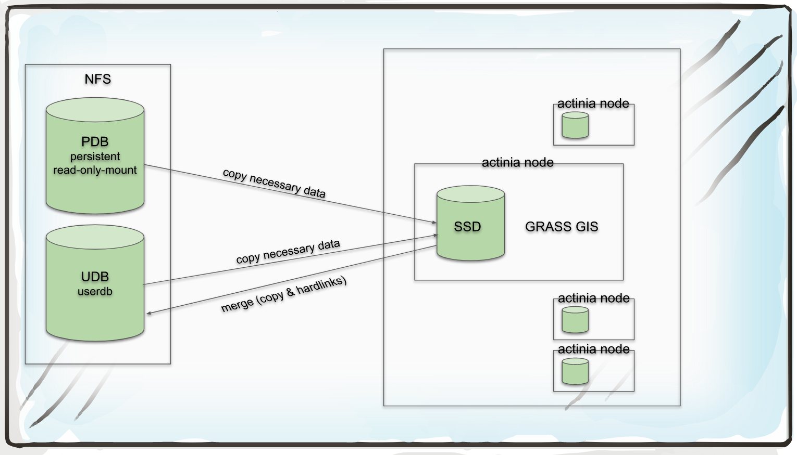
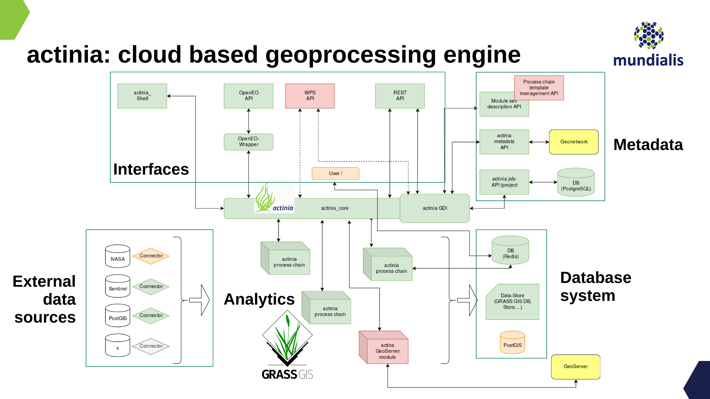
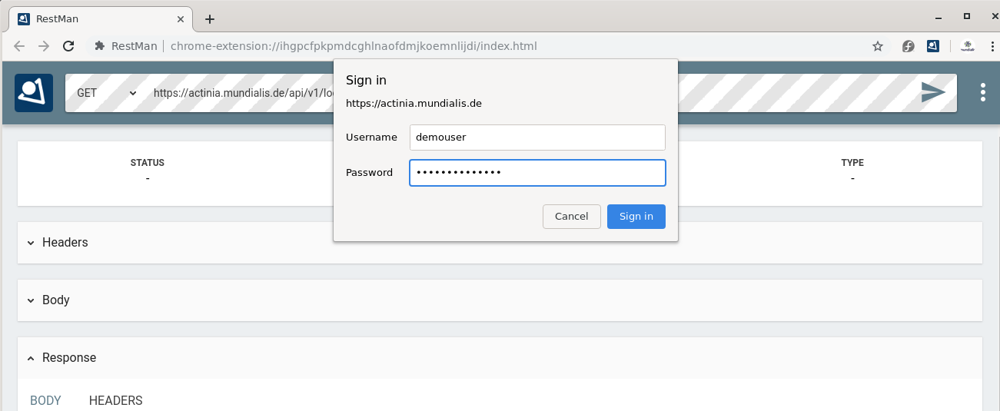
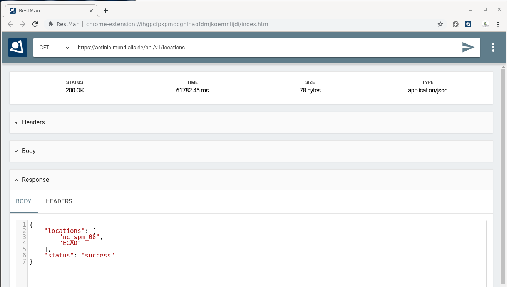
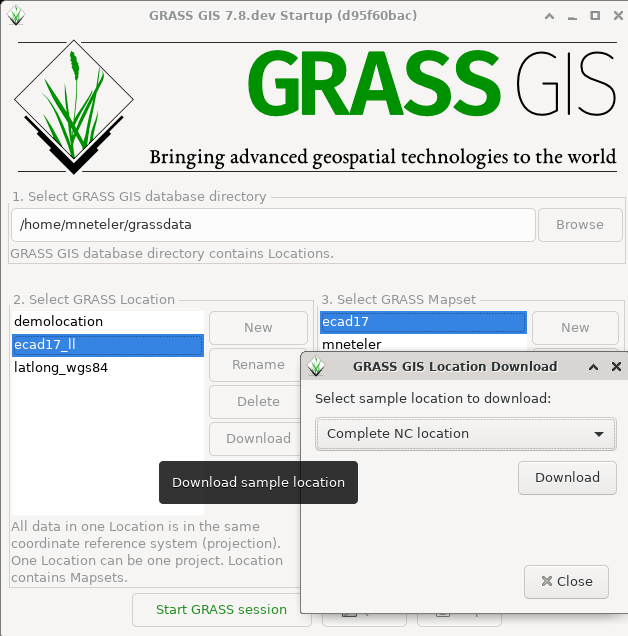

*Main page of this document: See [https://neteler.gitlab.io/actinia-introduction/](https://neteler.gitlab.io/actinia-introduction/)*

# actinia tutorial at Geostat 2019

Author: Markus Neteler, mundialis GmbH & Co. KG, Bonn

*Last update: 3 Sep 2019*

## Abstract

Actinia ([https://actinia.mundialis.de/)](https://actinia.mundialis.de/)) is an open source REST API for scalable, distributed, high performance processing of geographical data that uses mainly GRASS GIS for computational tasks. Core functionality includes the processing of single and time series of satellite images, of raster and vector data. With the existing (e.g. Landsat) and Copernicus Sentinel big geodata pools which are growing day by day, actinia is designed to follow the paradigm of bringing algorithms to the cloud stored geodata. Actinia is an OSGeo Community Project since 2019. In this course we will briefly introduce some Geo and EO data basics and give a short introduction to REST API and cloud processing concepts. This is followed by an introduction to actinia processing along with hands-on to get more familiar with the topic by exercises.

## Required software for this tutorial

* Chrome/Chromium browser
* RESTman extension: [https://chrome.google.com/webstore/detail/restman/ihgpcfpkpmdcghlnaofdmjkoemnlijdi](https://chrome.google.com/webstore/detail/restman/ihgpcfpkpmdcghlnaofdmjkoemnlijdi)
* For the "ace - actinia command execution" section:
    * Linux: `pip3 install click requests simplejson`
    * Windows users (OSGeo4W, Advanced installation, search window):
        * three Python packages: python3-click, python3-requests, python3-simplejson

Note: We will use the demo actinia server at [https://actinia.mundialis.de/](https://actinia.mundialis.de/) - hence Internet connection is required.

# Geostat 2019 tutorial

Planned tutorial time: 2:30 hs = 150 min

## Warming up

A graphical intro to actinia - [GRASS GIS in the cloud: actinia geoprocessing](https://mundialis.github.io/foss4g2019/grass-gis-in-the-cloud-actinia-geoprocessing/index.html) (note: requires Chrome/ium browser)

## Introduction

<!--
(10 min)
-->

For this tutorial we assume working knowledge concerning **geospatial analysis and Earth observation.** The tutorial includes, however, a brief introduction to **REST** (Representational State Transfer) API and cloud processing related basics.

<!--
### Geo and EO basics

* geodata layers
    * raster
    * vector
    * timeseries of both
    * image data (aerial, drone, satellite, ...)
* single and multispectral data (2-D arrays of reflectance values)
-->

### Why cloud computing ?

With the tremendous increase of available geospatial and Earth observation lately driven by the Copernicus programme (esp. Sentinel satellites) and increasing availability of open data the need for computational resources is growing in a non-linear way.

Cloud technology offers a series of **advantages**:

* scalable, distributed, and high performance processing
* large quantities of Earth Observation (EO) and geodata provided in dedicated cloud infrastructures
* addressing the paradigm of computing next to the data
* no need to bother yourself with the low-level management of petabytes of data

Still, some critical **issues** have to be addressed:

* lack of Analysis-Ready-data (ARD) available for consumption in the cloud
* lack of compatibility between different data systems
     * we are on it: openEO H2020 project[openEO H2020 project](https://openeo.org)
 * lack of cloud abstraction, for easier move between vendors and providers

### Overview actinia

Actinia ([https://actinia.mundialis.de/)](https://actinia.mundialis.de/)) is an **open source REST API for scalable, distributed, high performance processing of geospatial and Earth observation data** that uses mainly GRASS GIS for computational tasks. Core functionality includes the processing of single and time series of satellite images, of raster and vector data. With the existing (e.g. Landsat) and Copernicus Sentinel big geodata pools which are growing day by day, actinia is designed to follow the paradigm of bringing algorithms to the cloud stored geodata. Actinia is an OSGeo Community Project since 2019. The source code is available on GitHub at [https://github.com/mundialis/actinia_core](https://github.com/mundialis/actinia_core). It is written in Python and used Flask, Redis, and other components.

**Functionality beyond GRASS GIS**

While at time actinia is mainly a REST interface to GRASS GIS it offers through wrapping the possibility to extend its functionality with other software (ESA SNAP, GDAL, ...). Extensions are added by writing a GRASS GIS Addon Python script which then includes the respective function calls of the software to be integrated.

**Persistent and ephemeral databases**

With **persistent storage** we consider a data storage which keeps data also in case of shutoff as well as keeping them without a scheduled deletion time. In the Geo/EO context, persistent storage is used to provide, e.g. the base cartography, i.e. elevation models, street networks, building footprints, etc.
The **ephemeral storage** is used for on demand computed results including user generated data and temporary data as occurring in processing chains. In an ephemeral storage data are only kept for a limited period of time (e.g., for 24 hs).

In the cloud computing context this is relevant as cost incurs when storing data.

Accordingly, actinia offers two modes of operation: persistent and ephemeral processing. In particular, the **actinia server** is typically deployed on a server with access to a persistent GRASS GIS database (PDB) and optionally to one or more GRASS GIS user databases (UDB).

The actinia server has access to compute nodes (**actinia nodes**; separate physically distinct machines) where the actual computations are performed. The actinia server acts as a **load balancer**, distributing jobs to actinia nodes. Results are either stored in GRASS UDBs in GRASS native format or directly exported to a different data format (see Fig. 1).

<center>
<a href="img/actinia_PDB_UDB.png"></a><br>
Fig. 1: Architecture of an actinia deployment (source: [mundialis FTTH talk 2019](https://mundialis.github.io/foss4g2019/digging_earth_ftth_grass_actinia/2019_foss4g_bucharest_digging_earth_ftth_grass_actinia.pdf) )
</center>

**Deployment**

In a nutshell, deployment means to launch software, usually in an automated way on a computer node. A series of technologies exist for that but importantly virtualization plays an important role which helps towards a higher level of abstraction instead of a high dependency on hardware and software specifics.

An aim is to operate **Infrastructure as Code** ([IaC](https://en.wikipedia.org/wiki/Infrastructure_as_code)), i.e. to have a set of scripts which order the needed computational resources in the cloud, setup the network and storage topology, connect to the nodes, install them with the needed software (usually docker based, i.e. so-called containers are launched from prepared images) and processing chains. Basically, the entire software part of a cloud computing infrastructure is launched "simply" through scripts with the advantage of restarting it easily as needed, maintain it and migrate to other hardware.
**CI/CD** systems (continuous integration/continuous deployment) allow to define dependencies, prevent from launching broken software and allow the versioning of the entire software stack. 

In terms of actinia, **various ways of deployment** are offered: local installation, docker, docker-compose, docker-swarm, Openshift, and kubernetes.

**Architecture of actinia**

Several **components** play a role in a cloud deployment of actinia (for an example, see Fig. 2):

* analytics: this are the workers of GRASS GIS or wrapped other software,
* external data sources: import providers for various external data sources,
* interface layer:
    * most importantly the **REST API**,
    * [openEO GRASS GIS driver](https://github.com/Open-EO/openeo-grassgis-driver),
    * ace - [actinia command execution](https://github.com/mundialis/actinia_core/blob/master/scripts/README.md) (to be run from a GRASS GIS session),
* metadata management: interface to GNOS, managed through [actinia-GDI](https://github.com/mundialis/actinia-gdi/)
* database system:
    * job management in a Redis database
    * the GRASS GIS database (here are the geo/EO data!)
* connection to OGC Web services for output
   * Geoserver integration

<center>
<a href="img/actinia_architecture_FTTH.png"></a><br>
Fig. 2: Architecture of an actinia deployment (source: Carmen Tawalika)
</center>

## REST API and geoprocessing basics

<!--
(20 min)
-->

### What is REST: intro

An **API** (Application Programming Interface) defines a way of communicating between different software applications. There have been developed many different ways to implement APIs. A RESTful API (Representational State Transfer - REST, for details see [https://en.wikipedia.org/wiki/Representational_state_transfer](https://en.wikipedia.org/wiki/Representational_state_transfer)) is a web API for creating web services that communicate with web resources.

In detail, a REST API uses URL arguments to specify what information shall be returned through the API. This is not much different from requesting a Web page in a browser but through the REST API we can **execute commands remotely and retrieve the results**.

Each URL is called a **request** while the data sent back to the user is called a **response**, after some **processing** was performed.

<!--
###  Concepts of service URL, resources, request, response...

Looking in further detail into REST calls, we see that an API request consists of three parts (source: [https://www.earthdatascience.org/courses/earth-analytics/get-data-using-apis/intro-to-programmatic-data-access-r/](https://www.earthdatascience.org/courses/earth-analytics/get-data-using-apis/intro-to-programmatic-data-access-r/)):
*   Data **REQUEST**: through this you try to access an URL using your browser that specifies a particular subset of data.
*   Data **processing:** A web server somewhere uses that URL to query a specified dataset.
*   Data **RESPONSE**: The web server then sends you back some content.
-->

A **request** consists of four parts (see also [1]):

* the endpoints
* the header
* the data (or body)
* the methods

**Endpoint:**

An endpoint is the URL you request for. It follows this structure: https://api.some.server 
The final part of an endpoint is query parameters. Using query parameters you can modify your request with key-value pairs, beginning with a question mark (`?`). With an ampersand (`&`) each parameter pair is separated, e.g.:

`?query1=value1&query2=value2`

As an example, we check the repositories of a GitHub user, in sorted form:

[https://api.github.com/users/neteler/repos?sort=pushed](https://api.github.com/users/neteler/repos?sort=pushed)

**Header & Body:**

* Both requests and responses have two parts: a header, and optionally a body
* Response headers contain information about the response.
* In both requests & responses, the body contains the actual data being transmitted (e.g., population data)

**Methods and Response Codes**

(source: [2])

Request **methods**:
* In REST APIs, every request has an HTTP method type associated with it.
* The most common HTTP methods include:
* `GET` - a GET request asks to receive a copy of a resource
* `POST` - a POST request sends data to a server in order to create a new resource
* `PUT` - a PUT request sends data to a server in order to modify an existing resource
* `DELETE` - a DELETE request is sent to delete a resource

Response **codes**:
* HTTP responses don't have methods, but they do have status codes: HTTP status codes are included in the header of every response in a REST API. Status codes include information about the result of the original request.
* Selected status codes (see also [https://httpstatuses.com)](https://httpstatuses.com)):
    * 200 - OK | All fine
    * 404 - Not Found | The requested resource was not found
    * 401 - Unauthorized | The request is not authorized to be completed
    * 500 - Internal Server Error | Something went wrong while the server was processing your request

**JSON format**

JSON is a structured, machine readable format (while also human readable at the same time; in contrast to XML, at least for many people).

```bash
# this command line...
GRASS 7.8.dev (nc_spm_08):~ > v.buffer input=roadlines output=roadbuf10 distance=10 --json
```

looks like the following in JSON:

```json
{
  "module": "v.buffer",
  "id": "v.buffer_1804289383",
  "inputs":[
     {"param": "input", "value": "roadlines"},
     {"param": "layer", "value": "-1"},
     {"param": "type", "value": "point,line,area"},
     {"param": "distance", "value": "10"},
     {"param": "angle", "value": "0"},
     {"param": "scale", "value": "1.0"}
   ],
  "outputs":[
     {"param": "output", "value": "roadbuf10"}
   ]
}
```

Hint: When writing JSON files, some linting (validation) might come handy, e.g. using [https://jsonlint.com/](https://jsonlint.com/).

## First Hand-on: working with REST API requests

<!--
(50 min)
-->

### Step by step...

Step 1:

* get your credentials (for authentication) from the trainer (or use the "demouser" with "gu3st!pa55w0rd")

Step 2:

* choose and launch your REST client: cURL or RESTman or ...
    * a) [cURL](https://curl.haxx.se/docs/manpage.html), on command line
    * b) [RESTman](https://chrome.google.com/webstore/detail/restman/ihgpcfpkpmdcghlnaofdmjkoemnlijdi) in Browser
* Try this call: [https://actinia.mundialis.de/api/v1/locations](https://actinia.mundialis.de/api/v1/locations)

<center>
<a href="img/actinia_restman01.png"></a><br>
<a href="img/actinia_restman02.png"></a><br>
Fig. 3: Using RESTman
</center>

Step 3:

* Explore the existing data on the actinia server:
    * i.e., available GRASS locations, mapsets, raster, vector, and space-time datasets
    * Check the [list of data](https://github.com/mundialis/actinia_core/blob/master/scripts/README.md#available-data) currently available on the actinia server 
    * e.g.
        * [https://actinia.mundialis.de/api/v1/locations](https://actinia.mundialis.de/api/v1/locations)
        * [https://actinia.mundialis.de/api/v1/locations/nc_spm_08/mapsets](https://actinia.mundialis.de/api/v1/locations/nc_spm_08/mapsets)
        * [https://actinia.mundialis.de/api/v1/locations/nc_spm_08/mapsets/landsat/raster_layers](https://actinia.mundialis.de/api/v1/locations/nc_spm_08/mapsets/landsat/raster_layers)
        * [https://actinia.mundialis.de/api/v1/locations/nc_spm_08/mapsets/landsat/raster_layers/lsat5_1987_10](https://actinia.mundialis.de/api/v1/locations/nc_spm_08/mapsets/landsat/raster_layers/lsat5_1987_10)
    * process_results are ordered alphabetically, not thematically

Step 4:

* Submit a compute job and check its status (in case of asynchronous jobs by polling).

### Exploring the API

The actinia REST API documentation at [https://redocly.github.io/redoc/?url=https://actinia.mundialis.de/api/v1/swagger.json](https://redocly.github.io/redoc/?url=https://actinia.mundialis.de/api/v1/swagger.json) comes with a series of examples.

Check out the various sections.

### Further Examples

Here we use the command line and the `curl` software:

**Preparation:**

```bash
# set credentials and REST server URL
export actinia="https://actinia.mundialis.de"
export AUTH='-u demouser:gu3st!pa55w0rd'
```

**List locations:**

```bash
# show available locations (locations are like projects)
curl ${AUTH} -X GET ${actinia}/api/v1/locations
```

**List mapsets in locations:**

```bash
# show available mapsets of a specific location
curl ${AUTH} -X GET "${actinia}/api/v1/locations/nc_spm_08/mapsets"
```

**List map layers and their metadata:**

```bash
# show available vector maps in a specific location/mapset
curl ${AUTH} -X GET "${actinia}/api/v1/locations/nc_spm_08/mapsets/PERMANENT/vector_layers"

# show metadata of a specific vector map
curl ${AUTH} -X GET "${actinia}/api/v1/locations/nc_spm_08/mapsets/PERMANENT/vector_layers/geology"

# show available raster maps in a specific location/mapset
curl ${AUTH} -X GET "${actinia}/api/v1/locations/nc_spm_08/mapsets/PERMANENT/raster_layers"
curl ${AUTH} -X GET "${actinia}/api/v1/locations/nc_spm_08/mapsets/landsat/raster_layers"
curl ${AUTH} -X GET "${actinia}/api/v1/locations/nc_spm_08/mapsets/modis_lst/raster_layers"

# show metadata of a specific raster map
curl ${AUTH} -X GET "${actinia}/api/v1/locations/nc_spm_08/mapsets/landsat/raster_layers/lsat7_2000_40"

# show available STRDS in a specific location/mapset
# STRDS = space time raster data set
curl ${AUTH} -X GET "${actinia}/api/v1/locations/nc_spm_08/mapsets/modis_lst/strds"

# show specific STRDS in a specific location/mapset
curl ${AUTH} -X GET "${actinia}/api/v1/locations/latlong_wgs84/mapsets/modis_ndvi_global/strds/ndvi_16_5600m"

# Get a list or raster layers from a STRDS
curl ${AUTH} -X GET "${actinia}/api/v1/locations/ECAD/mapsets/PERMANENT/strds/precipitation_1950_2013_yearly_mm/raster_layers"

# Get a list or raster layers from a STRDS, with date filter
curl ${AUTH} -X GET "${actinia}/api/v1/locations/ECAD/mapsets/PERMANENT/strds/precipitation_1950_2013_yearly_mm/raster_layers?where=start_time>2012-01-01"
```

**Map layer queries:**

```bash
# query point value in a STRDS, sending the JSON code directly in request
curl ${AUTH} -X POST -H "content-type: application/json" "${actinia}/api/v1/locations/nc_spm_08/mapsets/modis_lst/strds/LST_Day_monthly/sampling_sync_geojson" -d '{"type":"FeatureCollection","crs":{"type":"name","properties":{"name":"urn:ogc:def:crs:EPSG::4326"}},"features":[{"type":"Feature","properties":{"cat":1},"geometry":{"type":"Point","coordinates":[7,50]}}]}'
```

**Sending JSON payload as a file:**

It is often much more convenient to store the JSON payload in a file and send it to server:

```bash
# store query in a JSON file "pc_query_point_.json" (or use a text editor for this)
echo '{"type":"FeatureCollection","crs":{"type":"name","properties":{"name":"urn:ogc:def:crs:EPSG::4326"}},"features":[{"type":"Feature","properties":{"cat":1},"geometry":{"type":"Point","coordinates":[7,50]}}]}' > pc_query_point_.json

# send JSON file as payload to query the STRDS
curl ${AUTH} -X POST -H "content-type: application/json" "${actinia}/api/v1/locations/nc_spm_08/mapsets/modis_lst/strds/LST_Day_monthly/sampling_sync_geojson" -d @pc_query_point_.json
```

**Validation of a process chain:**

actinia can also be used to validate a process chain. Download the process chain [process_chain_long.json](process_chain_long.json) and validate it:

```bash
# validation of a process chain (using sync call)
curl ${AUTH} -H "Content-Type: application/json" -X POST "${actinia}/api/v1/locations/nc_spm_08/process_chain_validation_sync" -d @process_chain_long.json
```

**Dealing with workflows (processing chains)**

* Prepare a processing chain
* async versus sync REST API calls
    * See: [https://github.com/mundialis/actinia_core/blob/master/scripts/curl_commands.sh#L77](https://github.com/mundialis/actinia_core/blob/master/scripts/curl_commands.sh#L77)
* Submit the processing chain

### Controlling actinia from a running GRASS GIS session

Controlling actinia from a running GRASS GIS session is a convenient way of writing process chains. It requires some basic GRASS GIS knowledge (for intro course, see [here](https://neteler.gitlab.io/grass-gis-analysis/).

The "ace" - actinia command execution from a GRASS GIS terminal is a wrapper tool written in Python which simplifies the writing of processing chains notably.

To try it out, start GRASS GIS with the `nc_spm_08` North Carolina sample location. You can download it easily through the `Download` button in the graphical startup (recommended; see Fig. 4) or from [grass.osgeo.org/download/sample-data/](https://grass.osgeo.org/download/sample-data/).

<center>
<a href="img/grass78_download_NC_location.png"></a><br>
Fig. 4: Download and extraction of `nc_spm_08` North Carolina sample location ("Complete NC location")
</center>

Before starting GRASS GIS with the downloaded location create a new mapset "ace" in `nc_spm_08`.

<p style="border:lightgreen solid 5px;padding:5px; width:50%">
Note: Since we want to do cloud computing, the full location would not be needed but it is useful to have for an initial exercise in order to compare local and remote computations.
</p>

**Needed Python libraries**

In case not yet present on the system, the following Python libraries are needed:

* Linux: `pip3 install click requests simplejson`
* Windows users (OSGeo4W, Advanced installation, search window):
    * three Python packages: python3-click, python3-requests, python3-simplejson


Now follow the instructions in

 [https://github.com/mundialis/actinia_core/blob/master/scripts/README.md](https://github.com/mundialis/actinia_core/blob/master/scripts/README.md)


### Further command line exercise suggestions

For this you can either use "ace" or write with an editor the JSON process chains and send them to actinia.

**Computations using data in the `nc_spm_08` location:**

* compute NDVI from a Landsat scene (using `i.vi`)
* slope and aspect from a DEM (there are several;  using `r.slope.aspect`)
* flow accumulation with `r.watershed` from a DEM
* buffer around hospitals  (using `v.buffer`)
* advanced: network allocation with hospitals and streets_wake (using `v.net.alloc`)
* generalizing vector polygons with GRASS GIS' topology engine (using `v.generalize`)

**Further examples incl. Spatio-Temporal sampling:**

See: [https://github.com/mundialis/actinia_core/blob/master/scripts/curl_commands.sh](https://github.com/mundialis/actinia_core/blob/master/scripts/curl_commands.sh)


## Own exercises in actinia

<!--
(40 min)
-->

**EXERCISE: "Population at risk near coastal areas"**

* needed geodata:
    * SRTM 30m (already available in actinia - find out the location yourself)
    * Global Population 2015 (already available in actinia - find out the location yourself)
    * vector shorelines (get from [naturalearthdata](http://www.naturalearthdata.com/downloads/))
* fetch metadata with actinia interface
* before doing any computations: what's important about projections?
* proposed workflow:
    * set computational region to a small subregion and constrain the pixel number through defined user settings
    * buffer SRTM land areas by 5000 m inwards
    * zonal statistics with population map

**EXERCISE: "Property risks from trees"**

(draft idea only, submit your suggestion to trainer how to solve this task)

* define your region of interest
* needed geodata:
    * building footprints
        * download from OSM (via [http://overpass-turbo.eu/](http://overpass-turbo.eu/) | Wizard > building > ok > Export > Geojson)
        * these data are now on your machine and not on the actinia server
        * use "ace importer" or cURL to upload
    * select Sentinel-2 scene
* proposed workflow:
    * actinia "ace" importer for building footprint upload
    * `v.buffer` of 10m and 30m around footprints
    * select S2 scene, compute NDVI with `i.vi`
    * filter NDVI threshold > 0.6 (map algebra) to get the tree pixels - more exiting would be a ML approach (with previously prepared training data ;-)) (`r.learn.ml` offers RF and SVM)
    * on binary tree map (which corresponds to risk exposure)
    * count number of tree pixels in 5x5 moving window (`r.neighbors` with method "count")
    * compute property risk statistics using buffers and tree count map and upload to buffered building map (`v.rast.stats`, method=maximum)
    * export of results through REST resources

## Conclusions and future

<!--
(15 min incl discussions)
-->

* integration in own scientific or business processes
* openEO actinia driver
* where is the code and how to contribute: GitHub
    * https://github.com/mundialis/actinia_core/

## See also: openEO resources

* OpenEO Web Editor: [https://open-eo.github.io/openeo-web-editor/demo/](https://open-eo.github.io/openeo-web-editor/demo/)
    * Server: [https://openeo.mundialis.de](https://openeo.mundialis.de)
    * user: 'actinia_user'
    * pw: 'actinia_pw'

## References

[1] Zell Liew, 2018: Understanding And Using REST APIs, [https://www.smashingmagazine.com/2018/01/understanding-using-rest-api/](https://www.smashingmagazine.com/2018/01/understanding-using-rest-api/)

[2] Planet 2019: Developer resource center, [https://developers.planet.com/planetschool/rest-apis/](https://developers.planet.com/planetschool/rest-apis/)

## About the trainer

Markus Neteler is partner and general manager at [mundialis](https://www.mundialis.de) GmbH & Co. KG, Bonn, Germany. From 2001-2015 he worked as a researcher in Italy. Markus is co-founder of OSGeo and since 1998, coordinator of the GRASS GIS development (for details, see his private [homepage](https://grassbook.org/neteler/)).

------------------------------------------------------------------------

- Repository of this material on [gitlab](https://gitlab.com/neteler/actinia-intro/tree/master)


*[About](about.md) | [Privacy](https://about.gitlab.com/privacy/)*

