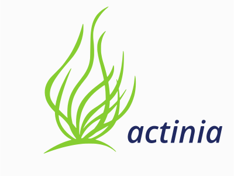

# A gentle introduction to actinia

Authors: Markus Neteler, Carmen Tawalika, Anika Weinmann, Guido Riembauer, mundialis GmbH & Co. KG, Bonn

<!-- **** Begin Fork-Me-On-Gitlab-Ribbon-HTML. See MIT License at https://gitlab.com/seanwasere/fork-me-on-gitlab **** -->
<a href="https://github.com/actinia-org/actinia-introduction/">
    Fork Me On GitHub
</a>
<!-- **** End Fork-Me-On-Gitlab-Ribbon-HTML **** -->

URL of this dcument: [https://actinia-org.github.io/actinia-introduction/](https://actinia-org.github.io/actinia-introduction/)

This workshop is a fork of [https://neteler.gitlab.io/actinia-introduction](https://neteler.gitlab.io/actinia-introduction). The initial workshop has a more detailed chapter about ace - the actinia command execution. This workshop focuses more on the "bare" HTTP API from actinia and extended excercises.

*Last update: 23 Aug 2022*

## Abstract

Actinia ([https://actinia.mundialis.de/](https://actinia.mundialis.de/)) is an open source REST API for scalable, distributed, high performance processing of geographical data that uses mainly GRASS GIS for computational tasks. Core functionality includes the processing of single scenes and time series of satellite images, of raster and vector data. With the existing (e.g. Landsat) and Copernicus Sentinel big geodata pools which are growing day by day, actinia is designed to follow the paradigm of bringing algorithms to the cloud stored geodata. Actinia is an OSGeo Community Project since 2019.

In this course we will briefly give a short introduction to REST API and cloud processing concepts. This is followed by an introduction to actinia processing along with hands-on to get more familiar with the topic by means of exercises.

## Required software for this tutorial

We will use an HTTP client to try out some REST commands. This can be a command line tool, code editor plugin or browser plugin.
This requires some software to be installed:

* REST client (one of the options below):
    * Command line tool: [cURL](https://curl.haxx.se/docs/manpage.html), to be used on command line
    * Extensions for Chrome/Chromium browser:
        * [RESTman extension](https://chrome.google.com/webstore/detail/restman/ihgpcfpkpmdcghlnaofdmjkoemnlijdi)
        * and a nice [JSON Formatter](https://chrome.google.com/webstore/detail/json-formatter/bcjindcccaagfpapjjmafapmmgkkhgoa)
    * Extension for code editor, here for VS Code
        * [Thunderclient plugin](https://www.thunderclient.io/)
        * If you use a different editor, a similar plugin might exist

* Not required for this workshop but nice to have:
    * [jq](https://stedolan.github.io/jq/download/), a lightweight and flexible command-line JSON processor
    * <a href="https://www.qgis.org/en/site/forusers/download.html">QGIS</a>

The "ace - actinia command execution" section is a demonstration only. To dive deeper into this topic,
you can follow [these installation instructions](https://neteler.gitlab.io/actinia-introduction/#preparation_1).

Note: We will use the demo actinia server at [https://actinia.mundialis.de/](https://actinia.mundialis.de/) - hence Internet connection is required.

## actinia tutorial overview

**Content**

* Warming up
* Some Concepts
    * Why cloud computing?
    * Overview actinia
    * REST API and geoprocessing basics
* Explore
    * First Hand-on: working with REST API requests
    * Exploring the API: finding available actinia endpoints
* Client implementations
    * actinia-python-client - A python client library
    * ACE - Controlling actinia from a running GRASS GIS session
    * actinia Connector - a QGIS plugin
    * actinia Jupyter Notebooks
* Own exercises in actinia
    * What is the altitude of the highest point in North Carolina? Check it with actinia.
    * Find the zipcode in Wake county with the most hospitals
    * Export the water bodies from the available Landsat imagery of North Carolina
    * Population at risk near coastal areas
* Conclusions and future
* See also: openEO resources
* References
* About the trainers

## Warming up

<!--
(duration: 20 min)
-->

To make you familiar with a few concepts, let's take a look at the "graphical intro to actinia" - [GRASS GIS in the cloud: actinia geoprocessing](https://mundialis.github.io/foss4g2019/grass-gis-in-the-cloud-actinia-geoprocessing/index.html) (note: it requires the Chrome/ium browser; presentation provided by <a href="https://github.com/mmacata/">Carmen Tawalika</a>, mundialis).

